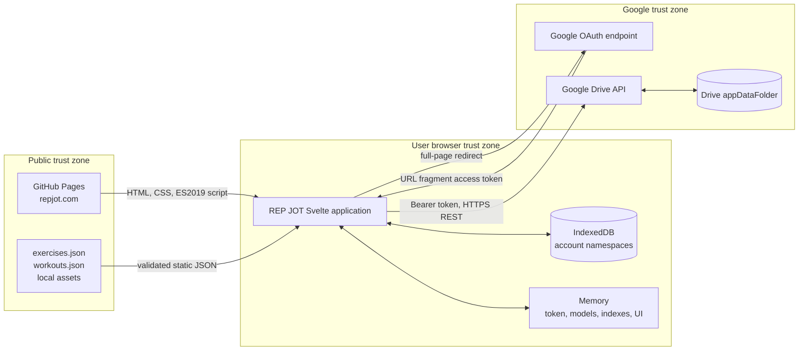
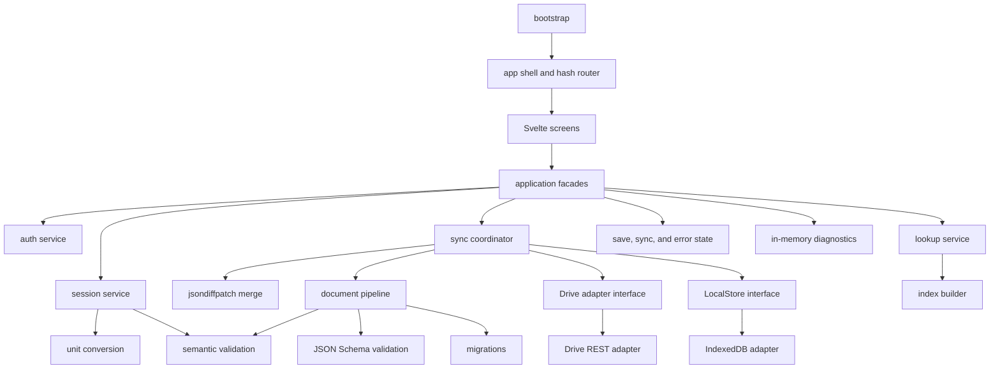

# REP JOT production architecture

## 1. Status and scope

**Status:** Approved production architecture for the v4 requirements. Phase 0 authorization testing is complete.

This document defines the browser architecture for REP JOT. It covers the static application, Google authorization, Drive synchronization, local storage, validation, UI boundaries, Kindle compatibility, security, testing, and release controls.

The application has no custom backend, server database, routing dependency, or state-management framework.

### Removed from the prior architecture

The v4 contract removes these prior designs:

- Frozen session `executionPlan` documents.
- Session tombstones.
- Sync copies and `conflictOfSessionId`.
- The `deprecated` flag and its result reason code.
- Static-data hashes, ID registries, and prior-production comparison.
- Persistent, salted diagnostic logs.
- IndexedDB repository and receipt layers beyond the required small storage facade.
- Automatic assumptions that static exercises, workouts, and nodes are immutable.

The architecture keeps only behavior that the signed-off v4 requirements and specifications require.

## 2. Sources and precedence

Use these sources in this order:

1. `AGENTS.md` and `docs/REQUIREMENTS.md`.
2. `specs/rep-jot-json-schema-spec.md`, `specs/storage-and-lookup.md`, `specs/schema-versioning.md`, and `specs/exercise-seeding.md`.
3. `design/DESIGN.md`.
4. The current schemas in `schemas/`.
5. `docs/Day-of Workout Execution UI — Design Brief.md`.
6. The HTML and PNG mockups in `design/`.
7. The current source code.

Official Google documentation is authoritative only for Google platform behavior that this repository does not define.

### Resolved source conflicts

| ID | Conflict | Architecture result |
| --- | --- | --- |
| C-01 | Earlier material names Google Identity Services. The physical Kindle supports the tested full-page implicit redirect. | Use the tested redirect flow and idempotent callback receipts. Do not use GIS, PKCE, authorization-code flow, popups, or a backend token exchange. |
| C-02 | The default GitHub Pages host differs from the required public URL. | Deploy the production site at `https://repjot.com`. |
| C-03 | The day-of brief advises against client routing. Static hosting needs reload-safe routes. | Use a small hash router. |
| C-04 | The day-of brief advises against custom fonts, Grid, sticky elements, and SVG controls. `design/DESIGN.md` requires local fonts and icon styling. | Bundle approved local fonts. Core controls do not depend on Grid, sticky positioning, SVG interaction, or a font glyph. |
| C-05 | Several mockups use `Forge`, rounded controls, effects, remote assets, or hover-only actions. | Use `REP JOT`, local assets, semantic controls, and the design requirements. |
| C-06 | Some mockups describe volume totals or completed-only history. | Show the statuses and history behavior required by `REQUIREMENTS.md`. Do not add aggregate volume without a requirement. |
| C-07 | The active-workout mockup shows global navigation. | Active Workout uses the compact Back header and no tab bar. |
| C-08 | The day-of brief describes a similar-workout lookup. | Last Time means the latest completed session for the exercise. |
| C-09 | A prototype UUID helper uses `Math.random()` as a fallback. | Session creation fails safely when `crypto.getRandomValues` is unavailable. `Math.random()` never generates a session ID. |
| C-10 | JSON Schema `date-time` accepts numeric offsets. | Persisted application timestamps have `Utc` field names and values that end in `Z`. |
| C-11 | Prior text used local time to choose a result shard. | The UTC month in `startedAtUtc` chooses the shard. Local time is display-only. |
| C-12 | Export includes all raw `appDataFolder` files. Delete recognizes only REP JOT names. | Export known and unknown files. Delete only recognized canonical files. |

## 3. Goals and non-goals

### Goals

- Keep four canonical document families with clear ownership.
- Save each user edit locally before Drive synchronization.
- Keep browser data separate for each Drive account.
- Support several devices without a reconciliation screen.
- Merge independent keyed-map changes without array-position errors.
- Resolve same-session conflicts by last synchronizer wins.
- Keep every Drive file independently valid and recoverable.
- Support several active workout sessions.
- Keep normal startup and history loading within Kindle limits.
- Let the static exercise and workout data change between releases.

### Non-goals

- A custom backend, server database, SQLite application dependency, or WebAssembly.
- Browser exercise or workout authoring.
- A service worker or a general offline application.
- Atomic transactions across Drive files.
- A conflict-reconciliation screen.
- Static-data ID immutability or compatibility checks against an earlier deployment.
- Automatic repair of unresolved exercise or workout references.

## 4. Constraints

- Use Svelte, TypeScript, Vite, and Bun.
- Vite writes the static site to `dist/`.
- Use only Bun commands. Do not use `node` or `npm`.
- Use the tested full-page OAuth implicit redirect.
- Request only `https://www.googleapis.com/auth/drive.appdata`.
- Keep canonical private data in Drive `appDataFolder`.
- Use IndexedDB only through the local storage facade.
- Use native `Map`, `Set`, and sorted arrays for runtime indexes.
- Compile the bundle to ES2019. Do not emit optional chaining or nullish coalescing.
- Support Kindle Silk 80, which has about 0.5 GiB memory and no `crypto.randomUUID`.
- Generate session UUIDs with `crypto.getRandomValues` and RFC 4122 version-4 bits.
- Persist application timestamps only in `*Utc` fields with RFC 3339 `Z` values.
- Use semantic and accessible controls. Always show the brand as `REP JOT`.
- The application has one basic user role. Global data changes only through the source repository and static build.

## 5. System context



GitHub Pages serves the application and static data. Google authorization replaces the current page and returns an access token in the URL fragment. Bootstrap validates the response, removes the fragment, then binds the token to a Drive account. Private documents move among Drive, validated models, and an account-scoped IndexedDB cache.

The browser profile is not a secure enclave. A person or extension that can read the profile can read IndexedDB.

## 6. Architectural decisions

| ID | Decision | Consequence |
| --- | --- | --- |
| ADR-001 | Use a hand-written hash router under `/#/`. | Reloaded and bookmarked routes need no server rewrite or routing dependency. |
| ADR-002 | Use the proven full-page OAuth implicit redirect and Drive REST. | Do not use popups, tabs, GIS, PKCE, authorization codes, or a backend exchange. |
| ADR-003 | Keep `Remember me on this device` unchecked by default. | Store an unchecked token in `sessionStorage`. Store a checked token in `localStorage` until exact expiry. |
| ADR-004 | Bind each token to `about.get(fields=user(permissionId))` before private cache access. | The Drive permission ID selects the account namespace. |
| ADR-005 | Use Ajv Draft 2020-12 with format assertion for browser document validation. | Ajv and `ajv-formats` are runtime dependencies. Bundle-size gates limit the cost. |
| ADR-006 | Use one small account-scoped `LocalStore` facade over IndexedDB. | No application module calls IndexedDB directly. The facade has only `get`, `set`, `delete`, and transactional `setMany`. |
| ADR-007 | Store cached documents, base copies, and pending deltas as whole values. | One `setMany` transaction makes a local edit durable without a storage framework. |
| ADR-008 | Use full Drive catalog reconciliation in release one. | The client makes more metadata requests than Changes API, but the behavior is direct and testable. |
| ADR-009 | Retain Drive file IDs and update files in place. | Drive metadata detects changes. It does not select schema versions or provide compare-and-swap. |
| ADR-010 | Automatically consolidate valid duplicate recognized files (Requirements 4.22–4.26). | Select a deterministic primary, merge valid copies, read back the primary, then delete redundant copies. Block the logical file when safe consolidation is impossible. |
| ADR-011 | Use `jsondiffpatch` for three-way merges of keyed maps. | Arrays are never used for concurrently edited collections. A conflict unit is one session or one preference mapping. |
| ADR-012 | Resolve a same-session conflict as last synchronizer wins. | The local full session replaces the remote full session during this synchronization. An edit beats a conflicting delete. Do not make a sync copy. |
| ADR-013 | Rebuild indexes in memory. | Do not persist derived indexes. |
| ADR-014 | Resolve every session against the current static workout tree. | Do not persist an `executionPlan`. A deploy can change an active workout. |
| ADR-015 | Treat static data as editable published facts. | Build validates schema, node-ID uniqueness, and exercise references only. Do not compare a release with a prior bundle. |
| ADR-016 | Keep diagnostics in a bounded in-memory ring. | Retain at most 200 events. Do not persist, salt, alias, synchronize, or upload diagnostics. |
| ADR-017 | Use a single `DataError` component for data problems. | The component offers **View Raw JSON** and **Dismiss**. It handles corrupt, unsupported, duplicate, and unresolved data without guessing. |
| ADR-018 | Keep a typed delete phrase. | Delete All User Data requires `DELETE ALL USER DATA` and warns that another device can recreate files. |
| ADR-019 | Bundle local fonts and a reviewed icon subset. | Primary actions keep visible text. Font or glyph failure does not hide an action meaning. |

### Dependency direction

```text
screens/components -> application services -> domain services
application services -> adapter interfaces -> infrastructure adapters
infrastructure adapters -> validation, migration, and domain types
```

Domain modules do not import Svelte, DOM, OAuth, Drive, or IndexedDB. Infrastructure modules do not import screens. UI code does not call `fetch` or IndexedDB directly.

## 7. Client module design



| Proposed path | Responsibility |
| --- | --- |
| `src/bootstrap.ts` | Load static data, handle the OAuth response, and start the shell. |
| `src/auth/auth-service.ts` | Own authorization, token expiry, account binding, sign out, and disconnect. |
| `src/auth/oauth-redirect-adapter.ts` | Build the redirect, validate state, process callback receipts, and clear the URL fragment. |
| `src/drive/drive-interface.ts` | Define catalog, read, create, update, delete, and account operations. |
| `src/drive/drive-rest-adapter.ts` | Call authenticated Drive REST endpoints and normalize Google errors. |
| `src/documents/static-loader.ts` | Fetch and validate bundled `exercises.json` and `workouts.json`. |
| `src/documents/document-pipeline.ts` | Parse, recognize, schema-validate, migrate, revalidate, and normalize documents. |
| `src/validation/schema-validator.ts` | Compile and run family-version JSON Schema validators. |
| `src/validation/semantic-validator.ts` | Validate cross-file references, paths, composite keys, units, scores, and shard placement. |
| `src/migrations/migration-registry.ts` | Hold pure ordered migrations for each family. |
| `src/storage/local-store.ts` | Define the small generic `LocalStore` interface. |
| `src/storage/indexeddb-local-store.ts` | Implement the facade with IndexedDB. |
| `src/sync/sync-coordinator.ts` | Reconcile catalog data, preserve local edits, upload, retry, and commit cache state. |
| `src/sync/merge-documents.ts` | Use `jsondiffpatch` to merge keyed maps and apply conflict rules. |
| `src/indexes/index-builder.ts` | Build maps, sets, and sorted arrays from validated models. |
| `src/indexes/lookup-service.ts` | Answer workout, active-session, recent, Last Time, and history queries. |
| `src/sessions/session-service.ts` | Create, edit, complete, abandon, delete, and load sessions. |
| `src/units/conversion.ts` | Convert compatible units at full precision and format editable values. |
| `src/routing/hash-router.ts` | Parse, validate, and navigate hash routes. |
| `src/state/app-state.ts` | Expose route, startup, save, sync, and error state to Svelte. |
| `src/ui/screens/*.svelte` | Compose one screen and keep temporary presentation state. |
| `src/ui/components/DataError.svelte` | Show one safe data-error interface and raw JSON action. |
| `src/diagnostics/diagnostic-log.ts` | Retain and export the in-memory diagnostic ring. |
| `scripts/seed-exercises.ts` | Generate the only writable exercise artifact from the pinned source and allowlist. |

The implementation can use different file names when it preserves these boundaries.

### Local storage facade

All cached application-document persistence uses this interface. OAuth state and tokens use the direct browser storage required by the authorization flow.

```ts
interface LocalStore {
  get(name: string): Promise<unknown | undefined>;
  set(name: string, value: unknown): Promise<void>;
  delete(name: string): Promise<void>;
  setMany(entries: Array<{ name: string; value: unknown }>): Promise<void>;
}
```

The facade stores whole values. It has no query API, index API, or partial-update API. Account keys namespace every value. The implementation keeps the facade small, near 50 lines.

For one logical Drive file, the synchronization layer stores:

- A working cached document with the Drive file ID, remote metadata, content, and cache time.
- The base document from the last known successful synchronization.
- The pending local delta.

A user save writes all three values with one `setMany` transaction. The transaction commits all three values or none.

## 8. Data ownership and formats

| Logical file | Format | Canonical owner | Writer |
| --- | --- | --- | --- |
| `exercises.json` | `repjot/exercises` v1 | Static bundle | Seed pipeline and application build |
| `workouts.json` | `repjot/workouts` v1 | Static bundle | Curated application build |
| `preferences.json` | `repjot/preferences` v1 | Drive `appDataFolder` | Preference service through sync coordinator |
| `results-YYYY-MM.json` | `repjot/results` v1 | Drive `appDataFolder` | Session service through sync coordinator |

Every document has `format` and `schemaVersion`. Drive metadata never selects a schema migration.

### UTC timestamps and shards

A session ID is `session-` plus a secure UUID v4. `startedAtUtc` is the UTC start time and ends in `Z`. The UTC year and month select the shard.

```ts
function shardName(startedAtUtc: string): string {
  return `results-${startedAtUtc.slice(0, 7)}.json`;
}
```

For example, a local start at `2026-08-31T23:30:00-07:00` persists as `2026-09-01T06:30:00Z` in `results-2026-09.json`.

A session stays in its original UTC start-month shard. Release one does not allow timestamp edits. Local dates and times are for display only.

### Keyed maps and result identity

Every collection that two devices can edit is a keyed map. Do not use arrays or array matching for these collections.

| Collection | Key |
| --- | --- |
| Shard sessions | Session ID |
| Exercise results | `<path>|<side>|<attempt>` |
| Container results | `<path>|<attempt>` |
| Preference units | Exercise ID, then dimension |

A result path joins segments with `/`. A repeated-container segment adds `:<iteration>`. The client writes `both` and `1` in every exercise-result key, even when they are defaults.

No `Record` key can be integer-like. The read model sorts result and session views on explicit `startedAtUtc` and `updatedAtUtc` fields. It never uses object-key iteration or insertion order as display order.

```text
root/squat-sets:3/back-squat-set|both|1
root/cindy|1
```

IDs cannot contain `/`, `|`, or `:`. Schemas enforce this identifier rule. A loader rejects a map key that does not match its structured result value.

Each session stores its direct `workoutId`. Each exercise result stores direct `workoutId`, `exerciseId`, `executionPath`, values, units, optional side, and attempt. Each container result stores direct `workoutId`, `executionPath`, status, and score.

No result stores a frozen workout plan. The UI overlays recorded results on the current workout tree. If a reference no longer resolves, the UI keeps stored values, sorts by encoded path when necessary, and shows `DataError`.

### State layers

| Layer | Content | Authority |
| --- | --- | --- |
| Drive | Preferences and monthly result shards | Canonical user data after a known remote read or write |
| Local cache | Downloaded canonical documents and metadata | Disposable read baseline |
| Pending local state | Base copy, working document, and pending delta | This browser's unsynchronized user intent |
| Validated models | Current in-memory document representation | Read model after validation |
| Runtime indexes | Maps, sets, and sorted arrays | Derived only |
| Svelte state | Route, selection, status, field text | Presentation only |
| Diagnostics | At most 200 in-memory support events | Never canonical and never synchronized |

The UI shows **Saved** only after the IndexedDB transaction succeeds. It can show a separate pending synchronization state.

### Static exercise seed

`scripts/exercise-allowlist.json` is the only author-written input for exercises. `scripts/seed-config.json` pins `yuhonas/free-exercise-db` to a commit. `bun run seed` writes `src/public/data/exercises.json`.

The seed script copies approved source fields, normalizes equipment against the schema vocabulary, and applies allowlist overrides. It does not copy source images. Exercise IDs are the source IDs.

`bun run seed:check` regenerates the document in memory and compares it with the committed file. `bun run seed:bump` updates the pinned source only after all generated data validates.

Static data is editable. Build validation does only these identity checks:

1. Each static document validates against its JSON Schema.
2. A workout has no duplicate node ID.
3. Each workout-node `exerciseId` resolves in `exercises.json`.

## 9. Startup, routing, and session behavior

### Startup and loading

1. Bootstrap loads and validates the static bundle.
2. The anonymous shell renders when static data is valid.
3. Authorization binds the token to a Drive account before private cache access.
4. A warm account cache can render while synchronization runs.
5. The first account load reads every result shard. Drive catalog metadata has no session status.
6. Later launches reuse unchanged valid cached shards.
7. The application loads terminal history on demand.

The loading sequence gives priority to preferences, the current shard, active sessions, and recent history. It then loads more history when a screen requests it.

The workout chooser shows all in-progress sessions first, sorted by `updatedAtUtc` newest first. Recent shows at most five completed or abandoned sessions, newest first. Each `Load older` action extends the requested history list.

A static-data failure blocks normal use. A corrupt cache is discarded and downloaded again. A corrupt remote file, future schema version, or duplicate file blocks only its logical file.

### Routes

| Route | Screen owner | Required state |
| --- | --- | --- |
| `/#/` | Anonymous landing or workout chooser | Static data and optional account indexes |
| `/#/workouts/:workoutId` | Workout Overview | Static workout lookup |
| `/#/sessions/:sessionId/active` | Active Workout | Session shard and current workout tree |
| `/#/sessions/:sessionId/summary` | Workout Summary | Session shard and static lookups |
| `/#/history` | Workout History | Loaded history indexes |
| `/#/exercises/:exerciseId/history` | Exercise History | Exercise lookup and loaded history |
| `/#/settings` | Settings | Authorized account and preferences |

Tab roots are Workout, History, and Settings. Detail and task routes use the compact Back header. The hash router shows a typed not-found state for an invalid route or unavailable ID.

### Visual and control rules

Shared tokens and centralized CSS define the interface. The theme uses high-contrast black, white, and middle gray for e-ink displays. Controls have zero-radius corners with no shadows, gradients, or blur.

Use styled native HTML controls. Application actions use Material Symbols. Fitness taxonomy can use bundled SVG icons. Every interactive element is a semantic link, button, or form control.

### Workout-session lifecycle

1. Create a session only from a current workout in the static bundle.
2. Generate a secure session UUID and a UTC start timestamp.
3. Save the new session to its UTC shard locally before navigating to Active Workout.
4. Resolve the session against the current workout tree on each load.
5. Debounce ordinary edits. Save on blur and before a route change.
6. Start a local flush on `pagehide`. Do not claim that a network save completed.
7. Complete or abandon a session by setting its terminal status and timestamps.
8. Delete a session by removing its key from the shard `sessions` map.
9. Edit terminal sessions against the current tree. Preserve terminal status, `startedAtUtc`, and `completedAtUtc`.

A stale device can restore a deleted session because release one stores no tombstone. The user can delete the restored session again.

A deploy can change an active workout because sessions have no frozen plan. The user restarts the session or edits its recorded result when this occurs.

Top-level prescription fields apply to every iteration. An `iterations` entry overrides only its present fields. Duplicate iteration numbers are invalid, and a finite repeated container rejects an out-of-range override.

Aggregate-only scored-container entry stores only the container score. Expanding the entry makes a draft child set from the score and current prescription. Draft values become recorded work only after a save. Saved child detail is authoritative. A nonstandard detail result uses `score.type: "nonstandard"` and shows **Detailed**.

Unit conversion keeps full internal precision. Editable displays round to the nearest `0.1`, with exact halves upward. An unedited rounded value does not change persisted precision. Without a saved preference, the first `compatibleUnits` entry is the default. Static data lists metric units before imperial units.

## 10. Authentication design

### Redirect authorization lifecycle

1. The anonymous landing page shows `Remember me on this device` and `Continue with Google`.
2. The application creates a secure OAuth `state` with a 30-minute lifetime and stores the request record in `sessionStorage` and `localStorage`.
3. The redirect requests `response_type=token` and only `drive.appdata`.
4. Google returns to the registered REP JOT URI with a URL fragment.
5. Bootstrap accepts a token only when its state matches an unexpired request record.
6. Bootstrap validates granted scope and computes `expiresAtUtc` from `expires_in`.
7. Bootstrap removes the fragment with `history.replaceState` before it loads private data.
8. An unchecked remember choice stores the token in `sessionStorage`.
9. A checked remember choice stores the token in `localStorage`.
10. Bootstrap stores a credential-free callback receipt for 60 seconds.
11. If Silk repeats the callback, bootstrap reuses only the exact token that it already accepted.
12. The Drive adapter gets `user.permissionId` and opens that account namespace.
13. A restored token repeats account binding before private cache access.
14. Expiry, `401`, or authorization failure erases token state and requires reauthorization.

The token record contains only the access token, expiry, granted scope, and bound account key. The temporary state record contains no token. REP JOT stores no refresh token.

The remember choice can last only for the access-token lifetime. It does not create durable sign-in. A stolen token can read, change, or delete REP JOT app-data until expiry.

### Sign out, disconnect, and deletion

**Sign out from REP JOT** erases token copies, request-state records, callback receipts, and account selection. It retains the local account cache and pending edits until the same Drive account authorizes again.

**Disconnect Google Account** is separate. The application posts the token to Google's revocation endpoint, waits for Drive to reject the token, then clears the selected account cache. If revocation fails, the UI links to Google Account connections.

**Delete All User Data** is separate from disconnect. The user must type `DELETE ALL USER DATA` before the action is available.

1. Reauthorize when necessary.
2. List all `appDataFolder` pages.
3. Delete every recognized REP JOT file by stable Drive file ID.
4. List again until no recognized file remains.
5. If deletion is partial, retain local data for retry and report the partial result.
6. If deletion completes, clear the selected account namespace and in-memory indexes.

The UI must not call this deletion irreversible. It warns that another device with pending edits can recreate data during its next synchronization.

## 11. Drive synchronization

### Catalog and duplicate files

The coordinator lists every catalog page with `spaces=appDataFolder`. It recognizes only `preferences.json` and `results-YYYY-MM.json`. Unknown files remain unchanged.

Drive permits duplicate names. The coordinator never ignores a duplicate group and never asks the user to choose a file. Requirements 4.22 through 4.26 make automatic consolidation the required behavior. The coordinator consolidates a duplicate group when every copy parses, has the correct family, uses a supported schema, and passes semantic validation.

For a valid duplicate group:

1. Download every copy and retain its file ID and metadata.
2. Select the lexicographically smallest file ID as the primary.
3. For result shards, union different session IDs. For the same session ID, keep the version with the greatest `(updatedAtUtc, Drive file ID)` tuple.
4. For preferences, merge different mappings. For the same mapping, keep the value from the file with the greatest `(updatedAtUtc, Drive file ID)` tuple.
5. Validate the consolidated document.
6. Recheck metadata for every duplicate.
7. Update and read back the primary file.
8. Delete redundant files only after the primary preserves the consolidated data.
9. List the name again before the local cache records one remaining file ID.

The tuple rule gives duplicate cleanup a deterministic result when Drive has no shared base document. Normal synchronization still uses last synchronizer wins. An edit beats a conflicting delete. The coordinator creates no tombstone and no sync copy.

If a duplicate copy is corrupt, unsupported, or changes during cleanup, the coordinator blocks that logical file. `DataError` offers raw inspection. Pending local edits remain durable.

### Merge policy

`jsondiffpatch` calculates a delta from base to local and from base to remote. The coordinator applies the remote delta to a copy of the base. It then applies local changes by conflict unit.

| Family | Conflict unit | Rule |
| --- | --- | --- |
| Results | One session ID | Different sessions merge. A same-session conflict uses the full local session because this client synchronizes last. |
| Preferences | One `(exerciseId, dimension)` mapping | Different mappings merge. A same-mapping conflict uses the local value. |

A conflict exists when both deltas touch a path below the same conflict unit. The coordinator does not field-merge a conflicted session.

An edit beats a delete in either direction. A local edit restores a remotely deleted session. A remote edit restores a locally deleted session. Do not mint a new session ID or label a result as a sync copy.

`preferences.json` increments `revision` and sets `updatedAtUtc` only for the final candidate that needs an upload.

### Reconciliation and writes

1. Acquire an in-memory per-account, per-logical-file mutex.
2. List all Drive catalog pages.
3. Consolidate valid duplicate groups before normal writes.
4. Drop local cache and base records whose Drive file ID no longer appears in the catalog.
5. Read cached, base, and pending local records.
6. Reuse a clean cached file when its metadata is unchanged.
7. Download changed, missing, or pending files and run the document pipeline.
8. For a pending file, compare base, local, and latest remote content.
9. Merge when remote differs from base.
10. Validate the complete upload candidate.
11. Serialize, parse, and validate the candidate again.
12. Recheck Drive metadata immediately before upload.
13. Update the retained file ID, or create a missing file.
14. Read the file after upload.
15. If the remote content matches, use one `setMany` transaction to save the confirmed document as working and base, then clear its pending delta.

The coordinator saves local intent before it starts network work. A Drive error keeps the working document, base copy, and pending delta.

Drive `files.update` does not provide content compare-and-swap. A metadata preflight narrows the race but does not close it. The read-back detects many overwrites.

On a mismatch, upload error, or ambiguous response, the coordinator reads Drive, makes a fresh merge, and retries at most three times. After three failed attempts, the UI shows **Sync failed** and keeps all pending edits.

A final race can still occur after a successful read-back. The next synchronization detects it. This is an accepted last-writer-wins boundary.

### Save status and diagnostics

- **Saving:** A local transaction or remote reconciliation is active.
- **Saved:** The newest user edit is durable in IndexedDB.
- **Sync failed:** Local data is durable, but Drive synchronization failed.

The diagnostic log stays in memory. It records at most 200 short, structured events. Events never include an OAuth token or authorization header. Settings can download the log as JSON. REP JOT never uploads it.

## 12. Validation and migration

The document pipeline uses these stages:

| Stage | Action | Failure behavior |
| --- | --- | --- |
| JSON parse | Parse bytes as `unknown` and apply size and nesting limits. | Keep pending edits and last valid cache. Do not overwrite remote data. |
| Envelope recognition | Read `format` and positive `schemaVersion`. | Reject missing, wrong, unsupported, and future envelopes. |
| Historical schema | Validate the declared family version with format assertion. | Stop before migration and report a safe path. |
| Migration | Apply one pure `vN -> vN+1` function at a time. | Keep source bytes unchanged. Do not invent identity. |
| Current schema | Validate each migration output and the final document. | Discard the migrated view on failure. |
| Semantic validation | Validate keys, paths, units, scores, shard placement, and cross-document invariants. | Block an invalid logical file. Mark unresolved current static references as nonfatal diagnostics. |

Each format family has an independent migration chain. Version one registers an empty chain. The loader uses the same path for an empty and non-empty chain.

A migration does not access Drive, IndexedDB, DOM, time, locale, or random APIs. A migration does not derive missing exercise identity from the current workout tree.

A newer-version document is never edited or overwritten by older code. The `DataError` component names the family, declared version, and highest supported version. It offers **View Raw JSON** and **Dismiss**.

An unresolved current static reference is nonfatal for reading and synchronization. The UI shows stored values and the error card. It does not substitute a similar exercise or rewrite history.

## 13. Kindle compatibility and UI limits

- Vite emits ES2019 output and the tested classic application loader.
- The release parses executable output as ES2019 and scans for optional chaining and nullish coalescing.
- `String.prototype.replaceAll` is the demonstrated Svelte polyfill. Add a polyfill only after a measured device failure.
- Session UUID creation uses `crypto.getRandomValues`. Session creation stops with a clear error when secure random values are absent.
- Do not use WebAssembly, SQLite, WebGL, canvas controls, or large chart libraries.
- Use monthly shards, compact indexes, bounded recent lists, and on-demand history loading.
- Use normal block flow and simple flex rows for core layout.
- Do not require CSS Grid, sticky positioning, transitions, animation, hover, gestures, or custom keyboards.
- Use native labeled inputs, `inputmode` hints, and keyboard-accessible controls.
- Do not use `window.open`, a popup, a tab, or a secondary window for authorization.
- Do not promise Wake Lock behavior.
- Export uses Blob, object URLs, and the download attribute.
- Do not register a service worker in release one.

Inter, JetBrains Mono, and Material Symbols are local same-origin assets. The icon manifest limits symbols to reviewed glyphs. Decorative icons use `aria-hidden`. Icon-only controls have accessible names. Primary and destructive actions retain visible text.

## 14. Security and privacy

### Token and account controls

The application sends access tokens to Drive only in HTTPS `Authorization: Bearer` headers. Google returns the token in a fragment. Bootstrap validates state and removes the fragment before private data access.

Sign out and disconnect erase memory, `sessionStorage`, and `localStorage` token copies. Account namespaces use the Drive permission ID. Account switching never reuses another account namespace.

IndexedDB has browser-profile protection only. REP JOT does not claim transparent local encryption.

### Export and untrusted data

Settings exports every raw file in `appDataFolder`, including unknown, corrupt, duplicate, and newer-version files. It preserves downloaded bytes and the Drive file name. The UI adds a Drive file-ID suffix when duplicate download names need separation.

Drive and static JSON pass through parsing, schema validation, migration, and semantic validation. Svelte renders text through interpolation. Do not use `innerHTML` for labels, instructions, notes, or errors.

Bundled SVG paths pass allowlists and sanitization. Runtime code uses same-origin `` paths only. Do not insert remote SVG or data URLs from JSON.

### Browser policy and supply chain

A CSP meta policy permits same-origin assets, top-level Google authorization, the required revocation form and hidden frame, and Drive HTTPS connections. It permits no GIS script, authorization frame, popup, telemetry, or remote UI dependency.

Use `bun.lock` and `bun install --frozen-lockfile`. Do not load runtime UI frameworks, fonts, analytics, or mockup assets from a CDN. Telemetry, crash reporting, behavioral analytics, and advertising are off.

## 15. Error handling

```ts
type AppErrorKind =
  | 'authentication'
  | 'authorization'
  | 'network'
  | 'drive_rate_limit'
  | 'drive_quota'
  | 'duplicate_drive_file'
  | 'unsupported_schema'
  | 'invalid_document'
  | 'migration'
  | 'semantic_reference'
  | 'storage'
  | 'ambiguous_upload';
```

| Category | UI behavior | Recovery |
| --- | --- | --- |
| Authentication or authorization | Explain that Google access did not complete or expired. | Retry the full-page redirect or sign out. |
| Network, rate limit, or quota | Show **Sync failed** without data loss. | Retry according to the bounded retry policy. |
| Duplicate recognized files | Show `DataError` if safe consolidation cannot finish. | Inspect raw JSON and retry after external repair. |
| Unsupported, corrupt, or migration data | Show `DataError`. | View Raw JSON. Do not edit or overwrite the affected file. |
| Unresolved static reference | Show stored result values and `DataError`. | Update compatible static data or inspect raw JSON. |
| Storage failure | Keep temporary field text. Do not show **Saved**. | Retry after browser storage recovery. |
| Ambiguous upload | Keep local intent and show saving or sync failure. | Read Drive before retry. |

Errors contain safe typed context. Diagnostics do not record raw error messages, tokens, authorization headers, file contents, notes, or measurements.

## 16. Testing strategy

| Area | Required coverage |
| --- | --- |
| Domain | UTC conversion and sharding, UUID format, composite keys, current-tree session editing, unit rounding, scores, and index ordering. |
| Schema | Every family and supported version, `Z` timestamps, rejected offsets, keyed maps, composite keys, and references. |
| Migration | Empty v1 chains, each supported input, deterministic output, immutability, future versions, and missing migration steps. |
| Seed | Allowlist IDs, equipment normalization, repeated dimensions, stale generated output, and source bumps. |
| Storage | Account separation, transactional `setMany`, rollback, quota errors, pending recovery, and cache corruption. |
| Synchronization | Different session IDs, same-session conflicts, edit-versus-delete, preference mappings, metadata races, ambiguous upload, three-retry limit, and cache commits. |
| Duplicate files | Valid automatic consolidation, deterministic primary choice, read-back before deletion, corrupt duplicate blocks, and changed-cleanup blocks. |
| Google adapters | Redirect state, callback replay, remember storage, expiry, account binding, pagination, `401`, `403`, `429`, and malformed responses. |
| Svelte | Routes, save status, DataError, raw export, diagnostics export, typed deletion phrase, and accessible controls. |
| Compatibility | ES2019 parsing, prohibited syntax scan, classic loader order, and required polyfills. |
| Kindle smoke | Redirect authorization, restored token, IndexedDB save, blur save, reload, synchronization, export, delete warning, and long workout scroll. |

Use a deterministic fake Drive for concurrency tests. It must pause before upload and before read-back. Ambiguous-upload tests must cover both a committed write with a lost response and a request that never commits.

Merge tests must show these properties:

- Different keyed entries merge without array drift.
- The last synchronizer wins for a same-session conflict.
- An edit beats a conflicting delete.
- A retry does not discard pending intent.
- Clients converge after edits stop and synchronization succeeds.

## 17. Build and deployment

The implementation uses these Bun commands:

```text
bun install --frozen-lockfile
bun run check
bun run test
bun run check:schemas
bun run seed:check
bun run build
bun run check:compat
```

`bun run build` runs schema validation and `seed:check` before Vite builds `dist/`.

Release gates include:

1. Svelte and TypeScript checks pass.
2. Unit and integration tests pass.
3. Every schema validates as Draft 2020-12.
4. Static data passes its three required checks.
5. The seed artifact matches the pinned source and allowlist.
6. The production bundle parses as ES2019 and has no prohibited syntax.
7. The bundle contains no token, client secret, telemetry endpoint, or unexpected remote code.
8. Local font assets, licenses, and glyph manifest checks pass.
9. Bundle size and file count stay within reviewed budgets.
10. `dist/CNAME` contains `repjot.com`.
11. Conventional-browser and physical-Kindle smoke tests pass.
12. OAuth consent, privacy, security-response, legal, and owned-domain checks complete.

Development and production use one Google Cloud project and its OAuth client configuration. Test traffic appears in that project. Vite receives only a public environment-specific client ID. No client secret enters source or `dist/`.

GitHub Pages serves the root of `dist/` at `https://repjot.com`. The build uses relative asset paths and copies `src/public/CNAME` to `dist/CNAME`.

## 18. Risks

| ID | Risk | Mitigation |
| --- | --- | --- |
| R-01 | Drive whole-file writes have a final race. | Use local intent, metadata preflight, read-back, bounded retries, and a later keyed-map merge. |
| R-02 | Kindle redirect, callback replay, storage, or revocation behavior can regress. | Preserve Phase 0 behavior and run physical Kindle tests for every release. |
| R-03 | IndexedDB can fail under storage pressure or browser cleanup. | Use transactional saves, clear UI state, export, and physical storage tests. |
| R-04 | History, static data, or detailed results can exceed Kindle limits. | Use monthly shards, bounded indexes, on-demand history, and measured bundle budgets. |
| R-05 | A corrupt, future-version, or duplicate Drive file can block its logical write path. | Keep raw export, `DataError`, pending local intent, and safe duplicate consolidation only. |
| R-06 | Static data can change while an active session is open. | Resolve current trees, preserve recorded result values, and let the user restart or edit the session. |
| R-07 | Another device can restore deleted data. | Warn during deletion. Use no irreversible-data claim. |
| R-08 | A remembered token exposes app-data until expiry. | Keep remember unchecked by default, enforce expiry, use CSP, and collect no telemetry. |

## Sources

- [Google OAuth 2.0 for client-side web applications](https://developers.google.com/identity/protocols/oauth2/javascript-implicit-flow)
- [Store application-specific data in Drive](https://developers.google.com/drive/api/guides/appdata)
- [Drive API files.list](https://developers.google.com/workspace/drive/api/reference/rest/v3/files/list)
- [Drive API files.update](https://developers.google.com/workspace/drive/api/reference/rest/v3/files/update)
- [Drive API files.create](https://developers.google.com/workspace/drive/api/reference/rest/v3/files/create)
- [Drive API about.get](https://developers.google.com/workspace/drive/api/reference/rest/v3/about/get)
- [Google Account third-party connections](https://support.google.com/accounts/answer/13533235?hl=en)
