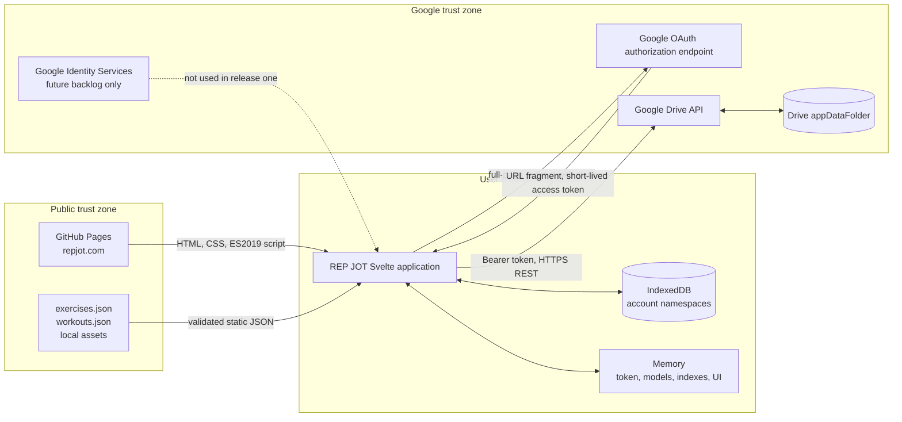
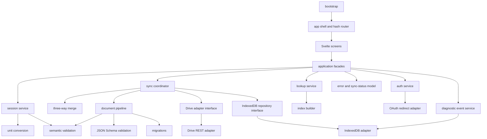
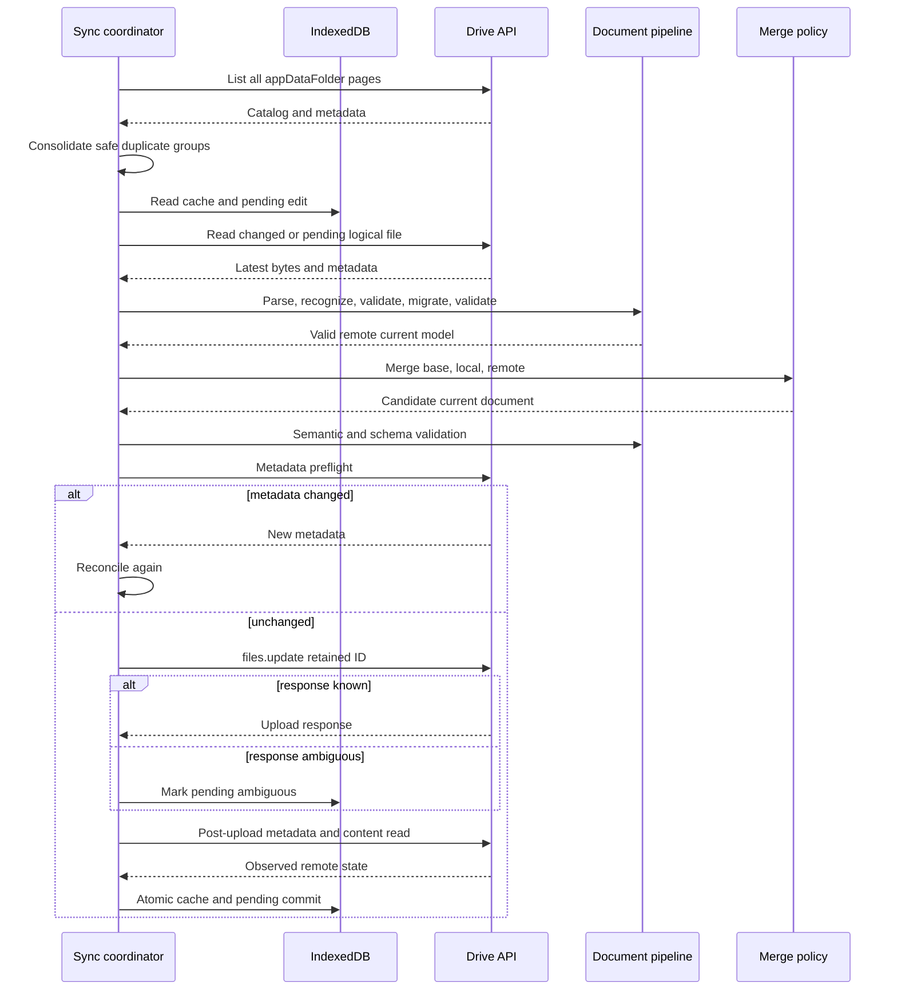
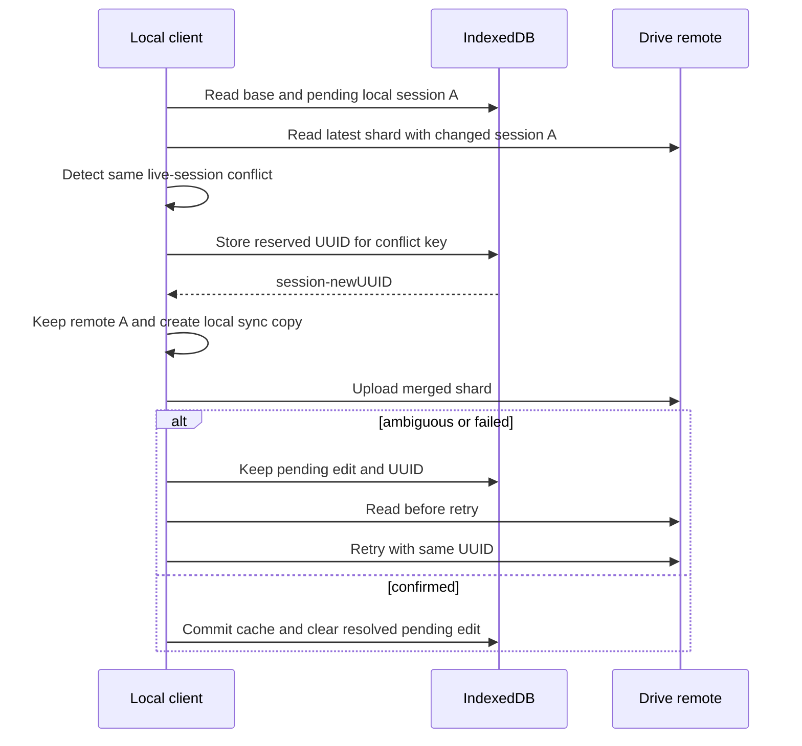

# REP JOT production architecture

## 1. Status and scope

**Status:** Proposed architecture for the first production release.

This document defines an implementation-ready client architecture. It does not change a product requirement, schema, mockup, or production file. It covers the static browser application, Google authorization, Drive synchronization, local persistence, domain behavior, testing, and release controls.

The architecture uses a small set of browser and build-time modules. It adds no custom backend, database server, state-management framework, or routing framework.

## 2. Sources and precedence

The architecture uses this authority order:

1. `AGENTS.md` and `docs/REQUIREMENTS.md`
2. `specs/rep-jot-json-schema-spec.md`, `specs/storage-and-lookup.md`, and `specs/schema-versioning.md`
3. `design/DESIGN.md`
4. The four Draft 2020-12 schemas in `schemas/`
5. `specs/Day-of Workout Execution UI — Design Brief.md`
6. The HTML and PNG mockups in `design/`
7. The current prototype source

Official Google documentation is authoritative only for Google platform behavior that the repository does not define.

### Meaningful source conflicts

| ID | Conflict | Higher authority and architecture effect |
| --- | --- | --- |
| C-01 | The fixed constraints name Google Identity Services (GIS), but the tested prototype uses Google's legacy full-page implicit redirect. The GIS token model requires popup dialog behavior that Kindle does not support. | The tested redirect-only prototype flow is the production flow. The GIS token model stays in the backlog until a physical-Kindle prototype proves a compatible flow. |
| C-02 | `README.md` names the default GitHub Pages host. Requirements and fixed constraints name `https://repjot.com`. | Production uses `https://repjot.com`. The default Pages host is not a production route. |
| C-03 | The day-of brief advises against client-side routing. Required screens need reload-safe navigation on static hosting. | A small hash router owns screen navigation. It needs no server rewrite and no routing dependency. |
| C-04 | The day-of brief advises against custom fonts, CSS Grid, sticky elements, and SVG controls. `design/DESIGN.md` requires Inter, JetBrains Mono, and Material Symbols. | Bundle the required fonts locally with system fallbacks. Core controls do not depend on a glyph, Grid, sticky positioning, or SVG interaction. |
| C-05 | Several mockups use rounded corners, shadows or blur, fixed navigation, hover-only affordances, remote assets, and the name `Forge`. | `design/DESIGN.md` and requirements win. Production uses zero-radius controls, no effects, local assets, semantic controls, and `REP JOT`. |
| C-06 | The Workout History mockup says that history contains completed sessions and displays workout volume. | Requirements win. History includes all required statuses and has no aggregate workout-volume metric. |
| C-07 | The Active Workout mockup uses a global header and shows navigation near the finish action. | Requirements win. Active Workout uses the compact Back header without the tab bar. |
| C-08 | The day-of brief describes “similar workout” history. Requirements define Last Time as the latest completed session for that exercise. | The lookup service uses the latest completed session and ignores the active session. |
| C-09 | The Dockerfile installs SQLite although requirements prohibit application use of SQLite. | The application and its build do not use SQLite. The package is unrelated devcontainer tooling and is not an application dependency. |
| C-10 | The prototype UUID helper falls back to `Math.random()`. Session IDs require secure random generation. | Session IDs fail safely when `crypto.getRandomValues` is absent. `Math.random()` is never a session-ID fallback. |
| C-11 | Earlier text selected a shard from the local calendar month encoded by a timestamp offset. That made one instant select different shards in different zones. | All application timestamps persist as explicit `*Utc` fields ending in `Z`. The UTC month in `startedAtUtc` selects the shard. Local time is display-only. |
| C-12 | JSON Schema `format: date-time` accepts numeric offsets and does not enforce UTC by itself. | Each timestamp schema combines `format: date-time` with a required `Z` suffix. Explicit `*Utc` field names remove storage ambiguity. |
| C-13 | Requirements export all raw files in `appDataFolder`, while deletion recognizes only REP JOT canonical names. | Export includes known and unknown app-data files. Delete All User Data deletes only recognized canonical names. |

## 3. Goals and non-goals

### Goals

- Preserve the four canonical document families and their ownership.
- Save user edits locally before each Drive synchronization attempt.
- Keep account data separate in IndexedDB.
- Support concurrent devices without a reconciliation screen.
- Preserve every detected live-session version through the required sync-copy policy.
- Keep startup and normal history loading within Kindle memory limits.
- Permit several active workout sessions.
- Make each Drive file independently valid and recoverable.
- Give each canonical file one owner and one write path.

### Non-goals

- A custom backend, server database, SQLite, or WebAssembly.
- Workout or exercise authoring in the browser.
- Social, coaching, analytics, gamification, or telemetry features.
- A general offline web application or service-worker cache.
- Atomic transactions across Drive files.
- A separate conflict-reconciliation interface.

## 4. Constraints

- Svelte, TypeScript, Vite, and Bun are mandatory.
- Vite writes the static site to `dist/` for GitHub Pages.
- Google's OAuth authorization endpoint supplies redirect-only browser authentication and authorization through the tested prototype flow.
- The GIS token model is a future option only. It cannot enter production without a Kindle prototype.
- The only requested OAuth scope is `https://www.googleapis.com/auth/drive.appdata`.
- Drive `appDataFolder` contains private canonical user data.
- IndexedDB contains the account-scoped cache and pending edits.
- Runtime indexes use native `Map`, `Set`, and sorted arrays.
- The browser bundle parses as ES2019 and contains no optional chaining or nullish coalescing.
- The tested Kindle has Silk 80, approximately 0.5 GiB memory, and no `crypto.randomUUID`.
- Session UUIDs use `crypto.getRandomValues` and RFC 4122 version-4 bit layout.
- Every persisted application timestamp uses an explicit `*Utc` field and an RFC 3339 value ending in `Z`.
- Local date and time values are derived for display only. They never select storage or shards.
- The UI uses semantic, accessible controls and always displays the brand as `REP JOT`.

## 5. System context



Text description: GitHub Pages serves public code and static data. Authorization replaces the current page and returns an access token in the URL fragment. Bootstrap validates OAuth state, stores the token under the selected remember policy, and removes the fragment immediately. Private documents move between Drive, validated models, and account-scoped IndexedDB.

The local browser profile is not a secure enclave. A person or extension with profile access can read IndexedDB. Drive remains the canonical remote store for user documents.

## 6. Architectural decisions

### Decision log

| ID | Decision | Tradeoff and operational consequence |
| --- | --- | --- |
| ADR-001 | Use a hand-written hash router with routes under `/#/`. | URLs are less clean, but direct navigation never needs a GitHub Pages rewrite or duplicate HTML fallback. |
| ADR-002 | Use the prototype's legacy OAuth implicit flow as a full-page redirect, then call Drive REST directly. Never request a popup, tab, or secondary window. | The flow works on the tested Kindle and needs no backend. Google discourages this legacy flow, so security review and regression tests are release gates. GIS token-model work remains backlog. |
| ADR-003 | Add an explicit `Remember me on this device` choice. An unchecked choice stores the short-lived token in `sessionStorage`; a checked choice stores it in `localStorage` with its exact expiry. | This survives the authorization redirect and avoids repeat authorization while the token remains valid. It cannot provide long-lived sign-in because the implicit flow returns no refresh token. A stolen token can read, change, or delete all REP JOT app-data until expiry. |
| ADR-004 | Derive the account namespace from Drive `about.get(fields=user(permissionId))` after authorization. | This binds the namespace to the token account. The UI cannot open private cache before that lookup succeeds. |
| ADR-005 | Use one small Draft 2020-12 validator dependency, with validators compiled once at startup. | The dependency adds bundle size, but complete schema support is a demonstrated requirement. Bundle and Kindle gates limit the cost. |
| ADR-006 | Use a typed native IndexedDB adapter without an object-store library. | More project code is necessary, but the application avoids another dependency and controls transactions directly. |
| ADR-007 | Store full base and local document copies in each pending edit. | Storage use increases, but three-way merge and failure recovery stay explicit and testable. Monthly shards bound the size. |
| ADR-008 | Use full Drive catalog reconciliation in release one. | It makes more metadata requests than the Changes API, but it is simple and reliable for few files. Changes tokens remain reserved. |
| ADR-009 | Keep Drive file IDs stable and update files in place. Automatically consolidate duplicate recognized names when every copy is valid and supported. | Drive does not enforce unique names. Consolidation preserves every detected session version before it deletes redundant files. Unsafe duplicate sets remain blocked. |
| ADR-010 | Use preflight metadata plus post-upload reads, not claimed compare-and-swap behavior. | A final write race remains possible. The client detects divergence later and applies merge policy. |
| ADR-011 | Build indexes in memory and never persist them. | Startup does traversal work, but cache migrations and memory duplication remain small. |
| ADR-012 | Use Svelte context plus narrow reactive stores only for UI state. | No global state framework is needed. Domain and persistence modules remain independent of Svelte. |
| ADR-013 | Do not register a service worker in release one. | Normal browser HTTP caching remains available. Deployment freshness and offline-cache invalidation stay simpler. |
| ADR-014 | Bundle Material Symbols as a same-origin WOFF2 font. Subset it to the reviewed glyph names used by REP JOT and keep its license in the distribution. Use trusted local SVGs through `` only for fitness taxonomy. | Local font loading removes a runtime Google Fonts dependency. Subsetting reduces transfer and Kindle memory costs, but the build must fail when code references a missing glyph. Every action keeps visible text or an accessible name. |
| ADR-015 | Use an injectable clock and full-precision conversion functions. Round converted editable displays to the nearest `0.1` in every unit. | Tests become deterministic. Display rounding never alters an unedited saved value, so repeated toggles avoid unnecessary drift. |
| ADR-016 | On a new empty cache, scan every result shard once, newest first, and retain only bounded summaries plus current models. | This first reconciliation downloads all history. Later normal startups reuse unchanged cached shards and can list every active session. |
| ADR-017 | Name persisted application timestamp fields with a `Utc` suffix and require RFC 3339 values ending in `Z`. Rename the shard marker to `yearMonthUtc`. | The names and schemas make UTC persistence explicit. This pre-production v1 correction avoids a migration because no REP JOT canonical user document has shipped. Local formatting stays outside canonical models. |
| ADR-018 | Keep a bounded diagnostic event ring in account-scoped IndexedDB and let the user download it from Settings. Never synchronize diagnostics to Drive or upload them automatically. | Support can inspect merge and cleanup decisions without a backend. Strict redaction and retention limits reduce local health-data exposure. |
| ADR-019 | Convert a scored container affected by a deprecated omission to detail-only execution and use `nonstandard` with complete observed detail. | Aggregate scores before and after omission are not comparable. Users enter more detail, and history preserves old recorded work. |
| ADR-020 | Edit terminal sessions against the current retained workout tree without storing a terminal `executionPlan`. | Files stay small and current corrections appear historically. New nodes can appear blank in an old session. |
| ADR-021 | Treat top-level prescription fields as defaults. An iteration entry overrides only its included fields. Reject duplicate iteration numbers. | Authors can express common work once and change selected fields by round without array-order precedence. |

### Dependency direction

The permitted direction is:

```text
screens/components -> application services -> domain services
application services -> adapter interfaces -> infrastructure adapters
infrastructure adapters -> validation/migration/domain types
```

An **adapter interface** is a TypeScript interface at an external-system boundary. For example, the Drive adapter interface describes list, read, update, and delete operations. The Drive REST adapter implements it with `fetch`. Tests implement it with an in-memory fake.

Domain modules do not import Svelte, DOM, OAuth, Drive, or IndexedDB. Infrastructure modules do not import screens. UI code cannot call `fetch` or IndexedDB directly.

## 7. Client module design



Text description: Svelte screens use application facades. Facades coordinate pure domain modules through adapter interfaces. Only adapters know browser APIs or Google APIs.

### Module-responsibility table

| Proposed path | Responsibility | Can depend on |
| --- | --- | --- |
| `src/bootstrap.ts` | Install required polyfills, load static data, open the shell, and start public state. | Configuration, document pipeline, shell |
| `src/auth/auth-service.ts` | Own redirect state, remember choice, token expiry, account selection, reauthorization, sign out, and revocation. | OAuth and Drive-about interfaces, clock |
| `src/auth/oauth-redirect-adapter.ts` | Build the legacy implicit authorization URL, replace the page, validate the returned state, and clear the URL fragment. | Browser location, history, and storage |
| `src/drive/drive-interface.ts` | Define the Drive adapter interface for catalog, content, create, update, metadata, delete, and about operations. | Shared types |
| `src/drive/drive-rest-adapter.ts` | Make authenticated Drive REST requests, paginate, parse errors, and apply retry headers. | Fetch, token provider |
| `src/documents/static-loader.ts` | Fetch `exercises.json` and `workouts.json` from the bundle. | Document pipeline |
| `src/validation/schema-validator.ts` | Validate one known family and version with Draft 2020-12 schemas. Assert `date-time` formats and all schema patterns. | Validator dependency, schemas |
| `src/validation/semantic-validator.ts` | Validate references, IDs, paths, units, uniqueness, scores, shards, and lifecycle rules. | Pure domain types |
| `src/migrations/migration-registry.ts` | Apply ordered, pure, family-specific migrations. | Historical schemas and pure migrations |
| `src/documents/document-pipeline.ts` | Parse, recognize, validate, migrate, revalidate, and normalize documents. | Schema, migration, semantic validation |
| `src/storage/idb-database.ts` | Open and upgrade the IndexedDB layout. | IndexedDB only |
| `src/storage/account-repository.ts` | Read and write account, document, metadata, and sync records. | IndexedDB database |
| `src/storage/pending-repository.ts` | Save base/local pending edits and generated conflict IDs atomically. | IndexedDB database |
| `src/sync/sync-coordinator.ts` | Serialize sync per account and file, run reconciliation, upload, retry, and cache commit. | Drive adapter interface, repositories, merge, pipeline |
| `src/sync/merge-results.ts` | Perform pure base/local/remote result merges and tombstone rules. | Domain types, UUID reservation input |
| `src/sync/merge-preferences.ts` | Merge preferences by exercise and dimension. | Domain types |
| `src/indexes/index-builder.ts` | Build native maps, sets, and sorted arrays from validated models. | Domain types |
| `src/indexes/lookup-service.ts` | Answer workout, active-session, recent, Last Time, and history queries. | Read-only indexes |
| `src/sessions/session-service.ts` | Create, edit, complete, abandon, delete, and fork sessions. | Pending repository interface, validation, units, clock, UUID |
| `src/sessions/execution-plan.ts` | Freeze new plans and reconstruct temporary terminal-session edit plans. | Static domain types |
| `src/units/conversion.ts` | Convert compatible values at full precision and format editable values. | Pure domain types |
| `src/routing/hash-router.ts` | Parse, validate, and navigate hash routes. | Browser history, route types |
| `src/state/app-state.ts` | Expose authentication, startup, route, error, and sync status to Svelte. | Application facades |
| `src/ui/screens/*.svelte` | Own one screen composition and temporary presentation state. | Facades and shared components |
| `src/ui/components/*.svelte` | Provide semantic headers, tabs, inputs, status, and workout-tree views. | Props, events, design tokens |
| `src/errors/app-error.ts` | Define typed errors, safe context, and user recovery actions. | No infrastructure |
| `src/diagnostics/diagnostic-service.ts` | Record bounded redacted events, create aliases, export recent JSON, and clear local events. | Diagnostic repository interface, clock, build information |
| `src/diagnostics/diagnostic-repository.ts` | Persist the account-scoped event ring and enforce age, count, and byte limits. | IndexedDB database |

Boundary sketch:

```ts
interface PendingDocumentEdit<T> {
  accountKey: string;
  logicalName: string;
  base: { content: T | null; metadata: RemoteMetadata | null };
  local: T;
  generatedSyncCopyIds: Readonly<Record<string, string>>;
  state: 'queued' | 'uploading' | 'ambiguous' | 'failed';
}

interface RemoteMetadata {
  fileId: string;
  version?: string;
  md5Checksum?: string;
  modifiedTime: string;
  size?: string;
}
```

## 8. Data ownership and formats

| Logical file | Format | Canonical owner | Reader | Sole write path |
| --- | --- | --- | --- | --- |
| `exercises.json` | `repjot/exercises` v1 | Static bundle | Static loader | Curated build pipeline |
| `workouts.json` | `repjot/workouts` v1 | Static bundle | Static loader | Curated build pipeline |
| `preferences.json` | `repjot/preferences` v1 | Drive `appDataFolder` | Sync coordinator | Preference service → pending edit → sync coordinator |
| `results-YYYY-MM.json` | `repjot/results` v1 | Drive `appDataFolder` | Sync coordinator | Session service → pending edit → sync coordinator |

All documents use JSON Schema Draft 2020-12. Each contains `format` and `schemaVersion`. Drive metadata never selects a schema migration.

A session ID is `session-` plus a secure random UUID. `startedAtUtc` contains the UTC workout start and ends in `Z`. The client converts local input to UTC before persistence. Its UTC calendar year and month select the shard. For example, local `2026-08-31T23:30:00-07:00` persists as `2026-09-01T06:30:00Z` in `results-2026-09.json`. Release one does not permit timestamp edits. Later result, note, status, and conflict edits keep `startedAtUtc` and the original UTC shard unchanged.

Machine schemas own document shape and reject timestamp offsets. Semantic validation owns references, identity preservation, paths, units, scores, filename agreement, and static compatibility.

```ts
function shardName(startedAtUtc: string): string {
  // Schema validation has already required an RFC 3339 value ending in Z.
  return `results-${startedAtUtc.slice(0, 7)}.json`;
}
```

The shard selector never receives a localized date string. UI formatters receive validated UTC values and derive local display text without writing it back.

### State layers and authority

| Layer | Content | Survives reload | Authority rule |
| --- | --- | --- | --- |
| Canonical Drive state | Preferences and monthly results | Yes | Remote canonical state after a known successful read or write |
| Cached canonical state | Last valid Drive bytes and metadata | Yes | Read baseline only, never a separate canonical source |
| Pending local edits | Base, local document, operation state, reserved IDs | Yes | Authoritative for this client's unsynchronized user intent |
| Migrated current models | Current in-memory shape plus provenance | Rebuilt or cached as disposable data | Authoritative for reads after full validation |
| Runtime indexes | Maps, sets, and sorted arrays | No | Derived read model only |
| Svelte UI state | Route, startup state, selection, status | No | Presentation only |
| Temporary form state | Uncommitted input text and focus state | No, until save event | Becomes user intent only after a local IndexedDB commit |
| Local diagnostics | Redacted support events and aliases | Yes, for bounded retention | Never canonical and never synchronized; user controls download and clearing |

The UI shows `Saved` only after the edit is in IndexedDB. A separate detail can say that Drive synchronization remains pending. Drive state becomes authoritative only after a successful remote read. A migration never makes its source canonical by itself.

### IndexedDB model

Database name: `repjot`. The IndexedDB layout has its own integer version.

| Store | Key | Indexes | Main fields |
| --- | --- | --- | --- |
| `accounts` | `accountKey` | `byLastUsedAtUtc` | Drive permission ID, display label if available, `createdAtUtc`, and `lastUsedAtUtc` |
| `documents` | `[accountKey, logicalName]` | `byAccount`, `byCachedAtUtc` | Drive file ID, raw canonical bytes, remote metadata, parsed current representation, provenance, `cachedAtUtc` |
| `pendingEdits` | `[accountKey, logicalName]` | `byAccount`, `byState`, `byNextAttemptAtUtc` | Base bytes and metadata, local current document, state, attempts, `nextAttemptAtUtc`, last safe error |
| `syncCopyIds` | `[accountKey, logicalName, conflictKey]` | `byPendingDocument` | Original session ID, deterministic conflict fingerprint, reserved new session UUID |
| `syncState` | `accountKey` | None | `lastFullSyncAtUtc`, optional Changes token, last completed sync ID, current lease marker |
| `operationReceipts` | `[accountKey, operationId]` | `byAccount`, `byLogicalName` | Expected content digest, upload outcome, file ID, observed metadata |
| `diagnosticEvents` | `[accountKey, eventId]` | `byAccountAndRecordedAtUtc`, `byCorrelationId`, `byCode` | `recordedAtUtc`, severity, event code, operation, correlation ID, build, and redacted context |
| `diagnosticState` | `accountKey` | None | Random alias salt, approximate byte count, event count, and oldest event time |

`documents` can store both source bytes and a parsed current representation. Provenance includes source family, source schema version, current schema version, validation version, and migration path.

#### Transaction boundaries

- A user save writes the pending edit and reserved conflict IDs in one read-write transaction.
- A successful remote read replaces a clean document and sync metadata in one transaction.
- A known upload commit replaces cached canonical state, updates the pending record, and writes a receipt in one transaction.
- Index rebuilding starts only after the transaction completes.
- Account deletion clears all account records in one local transaction only after all recognized remote files are gone.
- A diagnostic append and removal of expired or excess events use one separate transaction. Diagnostic failure never rolls back a canonical save.
- An IndexedDB version upgrade changes structure only. It never changes canonical JSON semantics.

#### Account lifecycle

- **Sign out from REP JOT:** Erase the token from memory, `sessionStorage`, and `localStorage`, then clear account selection. Retain the account cache and pending edits, but make them inaccessible until the same Drive account authorizes again.
- **Account switch:** Erase the token, authorize the new account, derive its account key, and select its namespace. Never reuse the prior namespace.
- **Disconnect Google Account:** Revoke the grant when possible, erase token state, and clear that account's local stores, including diagnostics. Keep other account namespaces.
- **Delete All User Data:** Delete recognized Drive files first. Then clear the selected account namespace, diagnostics, and in-memory indexes. Preserve local data if remote deletion is partial.
- **Browser storage clearing:** Lose disposable cache and pending edits. The next authorized launch does a full reconciliation. The UI must warn that unsynchronized edits cannot survive browser-data removal.

## 9. Startup and state lifecycle

```mermaid
sequenceDiagram
  actor U as User
  participant B as Bootstrap
  participant S as Static loader
  participant A as Auth service
  participant I as IndexedDB
  participant D as Drive
  participant UI as Svelte shell
  B->>S: Fetch and validate static documents
  alt static documents valid
    S-->>B: Current static models
    B->>UI: Show public anonymous landing
  else invalid or unavailable
    B->>UI: Show blocking application error
  end
  U->>A: Authorize with Google
  A->>D: about.get user.permissionId
  D-->>A: Account key
  A->>I: Open account namespace
  alt warm valid cache
    I-->>UI: Cached models and pending edits
    UI->>UI: Show authenticated screens
  else empty or invalid cache
    UI->>UI: Show loading state
  end
  A->>D: Full catalog reconciliation
  alt success
    D-->>I: Valid documents and metadata
    I-->>UI: Rebuilt current indexes
  else network failure with cache
    UI->>UI: Continue with cache; show Sync failed
  else network failure without cache
    UI->>UI: Show retry and sign-out actions
  end
```

Text description: public startup validates the static bundle first. Private cache stays closed until Drive identifies the authorized account. Warm data renders before full reconciliation, but pending edits remain visible and protected.

### Startup states

| Condition | Visible state | Permitted actions |
| --- | --- | --- |
| Anonymous | Public home, privacy link, and Google authorization action | Read public content and authorize |
| Authorized, warm current cache | Authenticated shell with cached data and sync indicator | Full use, including local saves |
| Authorized, empty cache | Blocking private-data loading state after static screens are ready | Retry, sign out, disconnect when possible |
| Authorized, stale cache | Cached screens marked as synchronizing | Read and edit locally; sync coordinator merges later |
| Network failure, warm cache | Cached screens and `Sync failed` | Continue local edits, retry, export locally available raw files |
| Network failure, empty cache | No fabricated preferences or history | Retry or sign out; workout starts are blocked because the user shard cannot be reconciled |
| Unsupported future Drive schema | Last valid unrelated documents remain available | Read unaffected files; block edits and overwrite of the affected file; export raw data |
| Corrupt Drive document | Last valid cache remains visible if present | Block writes to that logical file; download raw remote bytes and retry after external repair |
| Duplicate recognized filename | Show a consolidation status and keep all pending edits | Automatically merge valid copies and remove redundant files; block only when a copy is invalid, unsupported, or changes during cleanup |
| Invalid static bundle | Blocking application error | Reload after deployment repair; no workout use |

A cache becomes stale one hour after its last successful reconciliation, or when a network read finds changed metadata. Staleness does not invalidate a locally validated cache.

A new account namespace has no active-session index. Its first successful reconciliation reads every result shard, one file at a time. This exceptional scan finds all active sessions without retaining all shard models in memory. Warm normal startup downloads only new or changed shards.

## 10. Authentication design

### Redirect authorization lifecycle

1. The anonymous landing page shows `Remember me on this device` and `Continue with Google`.
2. The action creates a secure random OAuth `state` and stores that state plus the remember choice in `sessionStorage`.
3. The adapter replaces the current page with Google's authorization endpoint. It requests `response_type=token` and only `drive.appdata`.
4. Google returns to the exact registered REP JOT redirect URI. No popup, tab, or secondary window is involved.
5. Bootstrap reads the URL fragment, validates `state`, validates the returned scope, and calculates `expiresAtUtc` from `expires_in`.
6. Bootstrap removes the fragment with `history.replaceState` before it loads private data or writes diagnostics.
7. An unchecked remember choice stores the token record in `sessionStorage`. A checked choice stores it in `localStorage`.
8. The Drive adapter calls `about.get(fields=user(permissionId,displayName))` and binds the token to that account namespace.
9. Startup can restore an unexpired token, but it repeats Drive account binding before it opens cached private data.
10. Expiry or a `401` erases the token and enters `reauthorization_required` without deleting pending edits.
11. Reauthorization repeats the same full-page redirect and returns to the prior hash route.

The token record contains only the access token, `expiresAtUtc`, granted scope, and bound account key. The temporary OAuth state record holds the return route and remember choice, then bootstrap deletes it. The application never stores a refresh token because the implicit flow does not return one.

`Remember me on this device` can prevent repeat authorization only during the access token lifetime, typically about one hour. It cannot create durable sign-in across days. After expiry, REP JOT needs another full-page authorization redirect. A retained Google session and grant can reduce prompts, but that behavior requires a separate Kindle prototype before automation.

A stolen `drive.appdata` token has a smaller scope than a broad Drive token, but its impact is not small for REP JOT. Until expiry, it can read, change, or delete the user's complete REP JOT history and preferences. The checkbox must explain this device-local risk and must default to unchecked until product and privacy review approve another default.

The GIS token model is backlog only. Its popup-only dialog behavior is incompatible with the known Kindle window model. No GIS token-client code ships in release one.

### Sign out and disconnect

**Sign out from REP JOT** clears the token from memory and both browser storage locations. It does not revoke the grant, clear the account cache, or sign the person out of Google globally.

**Disconnect Google Account** is a separate Settings action. It first calls Google's documented token-revocation endpoint through its JSONP mode. The adapter adds one transient same-page script and removes it after the callback. It does not open another window. This integration needs a physical-Kindle prototype because the endpoint does not support CORS. On confirmed revocation, REP JOT signs out and clears the selected local account namespace.

If in-app revocation cannot report success, REP JOT keeps the local account data until the user confirms the fallback action. It links to Google Account connections, where the user can remove access. The UI must not claim that disconnect signs the user out of Google globally.

### Delete All User Data

This irreversible action is separate from disconnect. The user must type `DELETE ALL USER DATA` before the action becomes available:

1. Reauthorize if necessary.
2. List all `appDataFolder` pages.
3. Include every stable file ID for each recognized name, including duplicates.
4. Delete each recognized REP JOT file by stable file ID.
5. List again until no recognized file remains.
6. If a deletion failed, report partial deletion and retain local state for retry.
7. If all recognized files are absent, clear the account namespace and in-memory data.
8. Keep the OAuth grant unless the user also selects disconnect.

Unknown `appDataFolder` files remain unchanged.

## 11. Storage and synchronization

### Drive discovery

The release-one coordinator always starts with:

```text
files.list
spaces=appDataFolder
q=trashed=false
pageSize=1000
fields=nextPageToken,files(id,name,modifiedTime,md5Checksum,size,version)
```

It follows every `nextPageToken`. It recognizes only `preferences.json` and names matching `results-YYYY-MM.json`. It groups files by exact recognized name.

Drive permits duplicate names, including in `appDataFolder`. Duplicates can occur when two new devices both observe a missing file and create it concurrently. They can also come from an older client that retries an ambiguous create with a new file ID. A prior software defect is another possible cause. Users do not normally create these files through the Drive UI.

REP JOT does not expose a duplicate-repair screen. The coordinator automatically consolidates a duplicate group only when every copy parses, has the expected family, uses a supported schema, and passes semantic validation:

1. Download every copy and retain each file ID and metadata.
2. Select the lexicographically smallest Drive file ID as the deterministic primary. This selection does not discard another copy.
3. For result shards, union tombstones first and then union different session IDs.
4. If duplicate shards contain different live versions of one session ID, keep the primary-file version under the original ID. Convert each distinct secondary version into a sync copy with a durable conflict key.
5. For preferences, merge different mappings. For a same-mapping duplicate conflict, select the greatest deterministic tuple of document `revision`, document `updatedAtUtc`, and Drive file ID. A pending local mapping still wins when this client synchronizes afterward.
6. Validate the consolidated document and preflight metadata for every duplicate.
7. Update and read back the primary file.
8. Delete redundant file IDs only after the primary contains every preserved version. If redundant metadata changed, stop deletion and merge again.
9. List the group again and commit the one remaining file ID to IndexedDB.

If one copy is corrupt, unsupported, or changes repeatedly, synchronization for that logical name stops with `DuplicateDriveFileError`. REP JOT keeps pending edits and offers raw export and support diagnostics, but no repair UI.

The coordinator retains the canonical file ID. Normal updates use `files.update` against that ID. Unknown files remain untouched and appear only in safe diagnostics.

`md5Checksum`, `version`, and `modifiedTime` are change indicators. The adapter prefers checksum, then version, then modified time. None selects schema versions or provides a write lock.

### Diagnostic event capture

The sync coordinator creates one correlation ID for each reconciliation or cleanup run. It writes structured events at decision boundaries rather than capturing console text.

```ts
interface DiagnosticEvent {
  schemaVersion: 1;
  eventId: string;
  recordedAtUtc: string;
  severity: 'info' | 'warning' | 'error';
  code: string;
  operation: string;
  correlationId: string;
  buildId: string;
  context: Readonly<Record<string, string | number | boolean | null>>;
}
```

General synchronization records catalog page counts, cache decisions, validation outcomes, merge counts, metadata preflight results, retries, ambiguous responses, read-back results, and cache commits. It records errors with typed category and HTTP status when available.

Duplicate cleanup records these events:

1. Duplicate count and redacted file aliases.
2. Validation outcome for each alias.
3. The deterministic primary alias.
4. Session, tombstone, preference, and conflict-copy counts.
5. Metadata recheck outcomes for every alias.
6. Primary upload and read-back confirmation.
7. Each redundant-file deletion outcome.
8. Final catalog confirmation or the exact blocked stage.

A random account-local salt creates stable aliases for account keys, Drive file IDs, logical names, session IDs, and content digests. The exported events let support correlate values without receiving the source identifiers.

Events never include tokens, authorization fragments, raw account or Drive IDs, file content, workout or exercise names, notes, measurements, or canonical result values. The service never records a raw `Error.message`, stack trace, request body, response body, or URL query. Callers supply only allowlisted typed context. Logging failures are best-effort errors and never change merge or persistence outcomes.

Settings provides **Download diagnostic log** and **Clear diagnostic log**. Download creates `rep-jot-diagnostics-YYYYMMDDTHHMMSSZ.json` with export schema version, build information, retention limits, coarse browser family, capability booleans, and recent events. It excludes the complete user-agent string. REP JOT shows a privacy notice before download. It never sends this file automatically.

The ring retains seven days, at most 500 events, and at most 256 KiB for one account. The repository removes oldest events when any limit is exceeded.

### Synchronization sequence



Text description: every write compares base, local, and latest remote content. The coordinator validates the merged result, checks metadata, updates one file, reads it back, and only then commits the cache.

### Complete reconciliation algorithm

1. Acquire an in-memory per-account, per-logical-file mutex. IndexedDB does not provide cross-tab locking.
2. List the complete Drive catalog and run safe duplicate consolidation before normal writes.
3. If consolidation cannot preserve every valid version, block only that logical name and keep its pending edits.
4. Read cached document, metadata, pending edit, reserved sync-copy IDs, and operation receipts.
5. For each clean unchanged remote file, reuse the validated cached current representation.
6. For each missing or changed clean file, download and run the full document pipeline.
7. For each pending file, always download the latest remote bytes before upload.
8. Treat a missing remote file as a null remote base. Create an empty valid family document only for a first local edit.
9. Compare base-to-local and base-to-remote changes at semantic mapping or session granularity.
10. Apply the required family merge policy.
11. Increment preference `revision` and set document `updatedAtUtc` only for the final preference candidate.
12. Validate the complete current candidate. Serialize it, parse it, and validate it again.
13. Read current metadata immediately before upload. If it differs, restart from step 7.
14. Update the retained Drive file ID. For a new file, call `files.generateIds` with `space=appDataFolder`, persist the ID, and provide it to `files.create`.
15. Mark the pending edit `uploading` before sending bytes.
16. If the request has a timeout, connection reset, or unreadable response, mark it `ambiguous` and do not retry yet.
17. Read metadata and content after every known or ambiguous upload.
18. If remote content equals the expected serialized document, treat the operation as committed.
19. If remote content differs, keep the pending edit and reconcile against the observed remote state.
20. In one IndexedDB transaction, store known remote bytes and metadata, update or clear pending mutations, and write the receipt.
21. Rebuild only affected indexes after the transaction commits.
22. Remove clean cached records for recognized remote files that no longer exist. Never remove a record with pending edits.

For an ambiguous create, the coordinator reads the reserved file ID before another request. If the file exists with expected content, the create committed. If it does not exist, the coordinator retries creation with the same ID. A name collision from an external writer still enters duplicate-name handling.

### Retry behavior

- Retry transient network errors and Drive `429` or retryable `5xx` responses with capped exponential backoff and jitter.
- Honor `Retry-After` when supplied.
- Do not retry validation, schema, semantic, unsafe-duplicate, or authorization errors automatically.
- Require reauthorization after `401` or an authorization-related `403`.
- Keep all pending content, bases, and reserved UUIDs across retries and reloads.
- Read Drive before each retry of an ambiguous upload.
- Serialize synchronization for one logical file. Parallel reads for separate result shards are permitted with a small concurrency limit.

### Metadata race boundary

`files.update` is not treated as compare-and-swap. Metadata preflight narrows the race but does not remove it. The post-upload read finds many ambiguous outcomes, but another writer can still write after that read.

Operation receipts retain the expected digest and prior base for later divergence diagnosis. On the next synchronization, a detected session divergence enters normal three-way merge. REP JOT never silently discards a detected session version. The remaining undetectable final-write race is risk R-01.

### Drive Changes API boundary

Release one does not use `changes.list`. The `syncState` store reserves a token field for a later measured optimization. If enabled later, the client must:

- Get a start token only after a successful full reconciliation.
- Follow all change pages.
- Commit `newStartPageToken` only after every page and local transaction succeeds.
- Restrict processing to recognized `appDataFolder` file IDs.
- Fall back to full reconciliation when a token expires or local state is inconsistent.

The Changes API is an invalidation feed, not a transaction or merge mechanism.

### Result merge policy

Define changes relative to the unchanged base copy. Apply all tombstones before live sessions.

- Changes to different session IDs merge automatically.
- A tombstone wins over a stale live session.
- A tombstone never creates a sync copy.
- Equal live changes collapse to one session.
- If both sides changed the same live session differently, preserve the remote session under the original ID.
- Convert the pending local version into a sync copy.
- Reserve a secure new `session-UUID` in IndexedDB before building the upload candidate.
- Set `conflictOfSessionId` to the original ID and preserve status and timestamps.
- Reuse the reserved UUID for every upload retry.
- Label the fork `Sync copy` in History through derived presentation state.

The conflict key combines the logical shard, original session ID, base digest, local digest, and first observed remote digest. This key retrieves the same reserved UUID after reload.



Text description: the original ID always belongs to the remote version. One durable conflict key always maps the pending local version to the same sync-copy ID.

#### Convergence

After a confirmed merged upload, the shard contains the remote original and the local sync copy. Other clients treat the new ID as a different session and merge it automatically. A retry uses the same ID, so it cannot add another copy. A later tombstone for either ID removes only that session and wins over stale copies of that ID.

### Preference merge policy

Treat each `(exerciseId, dimension)` mapping as one merge key. Different mapping changes merge automatically. For a same-key conflict, the pending local value wins because this client synchronizes after the observed remote value. The coordinator then increments the document revision once.

After that upload, later clients observe the new remote base. A client with no pending value accepts it. Another still-pending same-key value wins only when that client later synchronizes. Thus synchronization-arrival order determines the converged value, as required.

## 12. Validation and migration

The document pipeline has distinct stages:

| Stage | Action | Failure behavior |
| --- | --- | --- |
| JSON parsing | Parse source bytes as `unknown`; enforce byte and nesting limits before deep work. | Report invalid JSON. Keep pending edits and last valid cache. Never overwrite remote bytes. |
| Envelope recognition | Read only `format` and positive integer `schemaVersion`; match expected filename family. | Reject missing, mismatched, unknown, unsupported-old, or future envelopes with distinct errors. |
| Historical schema validation | Validate against the exact declared historical schema with format assertions enabled. | Stop before migration and report JSON Pointer paths. |
| Ordered migration | Apply pure `vN -> vN+1` functions with read-only validated context. | Report migration context and preserve source unchanged. Never guess identity. |
| Post-migration validation | Validate every intermediate output and the final current document. | Discard the migrated view and keep source canonical bytes unchanged. |
| Cross-file semantic validation | Validate references, identities, paths, units, uniqueness, scores, shard placement, and lifecycle. | Quarantine the affected logical document from edits and upload. Keep unaffected files usable. |
| Prior-production compatibility | Compare current static data with the prior production bundle during build. | Fail the build on ID deletion, reuse, parent or role changes, scoring-contract changes, or removed supported units. |

Migrations have no access to the DOM, clock, locale, random APIs, Drive, or IndexedDB. The order for context-dependent loading is exercises, workouts, preferences, then result shards.

Unsupported and invalid canonical Drive data remains untouched. An edit can write a supported old source only after migration, reconciliation, complete current validation, and a user change requiring write-back. Normal startup does not rewrite all history.

Semantic validation includes all 28 invariants in the JSON specification. It also validates trusted icon paths, UUID uniqueness, tombstone uniqueness, direct IDs, full execution paths, AMRAP detail completeness, and score recomputation.

## 13. Routing and UI boundaries

### Route design

The hash router uses these canonical routes:

| Route | Screen owner | Required state |
| --- | --- | --- |
| `/#/` | Anonymous landing or authenticated workout selection | Static data; optional authorized account indexes |
| `/#/workouts/:workoutId` | Workout Overview | Static workout lookup |
| `/#/sessions/:sessionId/active` | Active Workout and terminal historical editor | Loaded original shard and plan source |
| `/#/sessions/:sessionId/summary` | Workout Summary | Loaded original shard and static lookups |
| `/#/history` | Workout History | Recent loaded shards; older on demand |
| `/#/exercises/:exerciseId/history` | Exercise History | Exercise lookup and loaded history |
| `/#/settings` | Settings | Authorized account and preferences |

The root path always reaches `index.html` on GitHub Pages. The hash never goes to the server, so a direct bookmarked route loads the application without a 404.

### Navigation rules

- Tab roots are Workout, History, and Settings. They use the `REP JOT` header and tab controls.
- Detail and task routes use the compact Back header and no tab bar.
- Active Workout uses the compact Back header.
- Back first flushes a local save. For an active session, it preserves `in_progress` and returns to the prior valid route.
- A direct reload resolves route parameters only after account binding and required shard loading.
- An invalid or unavailable ID shows a typed not-found state and a safe route to its tab root.
- Browser history stores routes, not domain objects.
- Each `Load older` action adds five sessions or five exercise-history occurrences, as applicable.

Screens compose shared controls but do not own persistence. Temporary field text remains in the screen until a debounce or blur save commits it locally.

### Workout-session lifecycle

1. **Create:** Validate that the workout is not deprecated. Generate a secure session UUID. Convert the browser clock instant to `startedAtUtc` with a `Z` suffix.
2. **Freeze:** Copy the effective workout tree to `executionPlan`. Omit already deprecated exercises and record relevant `deprecated` skipped results. Convert each affected scored ancestor to detail-only behavior.
3. **Persist:** Create or update the UTC start-month pending shard in one IndexedDB transaction before navigation to Active Workout.
4. **Edit:** Use one session controller per open route. Several sessions can remain `in_progress` in separate shard documents.
5. **Save:** Debounce normal edits. Save immediately on blur and before route changes. On `pagehide`, synchronously start the IndexedDB flush that the browser permits. Do not claim that network completion is guaranteed.
6. **Complete:** If work is missing, offer `Return to workout` and `Finish as incomplete`. On finish, set `completed`, set `endedAtUtc`, update `updatedAtUtc`, and remove `executionPlan`.
7. **Abandon:** Set `abandoned`, set `endedAtUtc`, update `updatedAtUtc`, and remove `executionPlan`. Keep it in History.
8. **Delete:** Remove the live session and add its permanent tombstone to the original shard.
9. **Historical edit:** Build a temporary editor plan from the current retained workout tree, then overlay recorded results by execution path. Show new current-tree nodes with blank results. Show an already deprecated exercise only when the session records its path. Persist no terminal `executionPlan`. Preserve terminal `status`, `startedAtUtc`, and `endedAtUtc`. Release one provides no timestamp-edit controls. Only `updatedAtUtc` changes for ordinary result corrections.
10. **Sync copy:** Use the merge service. The normal summary, editor, and delete paths work for both IDs.

Untouched work creates no placeholder result. A programmed default remains presentation state until its input loses focus. On blur, the displayed value becomes an actual local result even when the user did not change it. A field that the user never enters remains omitted. Zero repetitions is actual data. Store `incomplete` only with relevant partial values, time, reason, or notes. Store `skipped` only when the skip is relevant.

Release one provides notes at every schema-supported user scope: session notes, exercise-result or attempt notes, and scored-container notes. Workout-node notes remain static programming data rather than user notes.

For optional AMRAP or EMOM detail, aggregate-only mode stores only the container score. Expansion creates the complete child set from score and workout order. After expansion, child results are authoritative. Every child edit recomputes the score. Invalid progression stores `nonstandard` and displays `Detailed`.

Unit pills update the preference mapping and convert only the currently edited value. Conversion keeps full internal precision. The editable display rounds to the nearest `0.1` in the selected unit, with exact halves rounded upward. If the user does not edit the rounded display, persistence keeps the full-precision converted value. If the user edits it, persistence uses the entered number. Existing saved results keep their explicit unit until edited.

For example, 100 kg converts internally to approximately 220.462 lb and displays as 220.5 lb. Five km displays as 3.1 mi. Ninety seconds displays as 1.5 minutes. A small positive value can display as `0.0` in a much larger unit, but it remains positive in persistence unless the user explicitly enters zero. Static exercise data should avoid impractical unit combinations.

If no preference exists, the first `compatibleUnits` entry is the default. Static semantic validation requires metric units before imperial units, including `kg` before `lb` and `m` or `km` before `ft` or `mi`. Single-unit dimensions keep their only unit. This ordering makes the default deterministic without a separate default field.

### Resolved domain cases

**Deprecated exercise in a scored container.** Consider a Cindy AMRAP with Pull-up, Push-up, and Air Squat leaves. If Push-up becomes deprecated, a new session omits it. The affected Cindy container becomes detail-only in the frozen effective plan. Its UI hides rounds-and-extra-reps entry and requires the remaining Pull-up and Air Squat details. Complete remaining detail stores `score: { "type": "nonstandard" }` and displays `Detailed`. Completeness covers every remaining leaf in each observed cycle that the user creates, not future possible cycles. Structurally complete detail with incomplete results can leave the score absent. If no executable child remains, the container is skipped with `reasonCode: "deprecated"` and no score. Historical sessions retain and display their recorded Push-up results.

**Terminal edit after workout additions.** Suppose a completed session recorded Squat nodes A and B. A later bundle adds node C. Historical editing uses the current tree, so A, B, and C appear. Results for A and B overlay by execution path, while C starts blank and can receive a historical correction. Current labels and prescriptions appear. A recorded deprecated path remains visible, while an unrecorded deprecated leaf stays hidden. The terminal session keeps its status and UTC timestamps. REP JOT stores no terminal `executionPlan`, so file size does not grow with a workout snapshot.

**Top-level prescription fields provide iteration defaults.** In this valid three-round prescription, iteration 1 is 5 reps at 80 kg. Iteration 2 is 3 reps at 100 kg because it overrides `reps` and inherits `weight`. Iteration 3 has no override, so it is 8 reps at 100 kg.

```json
{
  "reps": 8,
  "weight": { "value": 100, "unit": "kg" },
  "iterations": [
    {
      "iteration": 1,
      "reps": 5,
      "weight": { "value": 80, "unit": "kg" }
    },
    {
      "iteration": 2,
      "reps": 3
    }
  ]
}
```

Resolution starts with the top-level fields and replaces only fields present in the matching iteration entry. An iteration can add a field that has no top-level default. `null` cannot remove an inherited field.

This complete example is invalid because iteration 2 appears twice with conflicting `weight` overrides:

```json
{
  "reps": 8,
  "weight": { "value": 100, "unit": "kg" },
  "iterations": [
    {
      "iteration": 2,
      "weight": { "value": 90, "unit": "kg" }
    },
    {
      "iteration": 2,
      "weight": { "value": 80, "unit": "kg" }
    }
  ]
}
```

REP JOT rejects duplicate iteration numbers instead of using array order as precedence. For a finite repeated container, an override number cannot exceed the configured iteration count.

## 14. Kindle compatibility

- Vite compiles the application to `es2019` and emits a dynamically loaded classic `app.js`, matching the measured loader behavior.
- The build parses every executable output as ES2019 and scans for optional chaining and nullish coalescing.
- `String.prototype.replaceAll` is the only currently demonstrated Svelte polyfill. Add another polyfill only after a measured failure.
- The UUID helper uses `crypto.getRandomValues`. It sets UUID version and variant bits. Session creation fails with a clear error if secure random values are unavailable.
- The app does not use WebAssembly, SQLite, WebGL, canvas controls, or large chart libraries.
- Recent lists are bounded. Older shards load on demand. Indexes retain compact summaries instead of duplicate full documents.
- Release one sets no fixed document-size or memory budget. Monthly shards, one-shard operations, bounded recent lists, and on-demand history loading reduce peak memory without claiming a measured threshold.
- Core layout uses normal block flow and simple flex rows. CSS Grid, sticky positioning, transitions, and animation are not required for use.
- E-ink updates avoid animation, frequent timers, large repaint areas, shadows, gradients, blur, and changing fixed overlays.
- Inputs are native controls with labels, `inputmode` hints, and keyboard support. Correct operation does not depend on touch, hover, gestures, or custom keyboards.
- Authorization replaces the current page and returns to REP JOT. It never calls `window.open` and never depends on a tab, popup, or secondary window.
- Wake Lock is absent. The UI makes no keep-awake promise.
- Web Share is absent. Data export uses Blob, object URLs, and the download attribute.
- Service Workers are exposed but unmeasured. Release one registers none.
- Material Symbols ships as a same-origin WOFF2 font with a reviewed glyph subset. CSS uses `@font-face` and a system fallback. Icons are decorative when visible action text exists; icon-only controls have accessible names. The build checks every ligature name against the subset and preserves the font license.

### Local Material Symbols packaging

The repository pins one reviewed upstream Material Symbols font release and its license. A glyph manifest lists every symbol name that shared UI components can request. A build-time font task creates same-origin WOFF2 subsets for the used outlined and filled forms. Generated font files are release assets, not runtime dependencies. Inter and JetBrains Mono also ship as pinned same-origin WOFF2 files for only the required weights.

A shared Svelte icon component accepts only manifest names. It marks decorative glyphs `aria-hidden`. An icon-only control supplies its accessible name on the button, not on the font glyph. Primary and destructive actions retain visible text, so font failure cannot hide their meaning. The release compares font bytes against a size budget and tests each glyph on Kindle.

A physical Kindle smoke test remains a release gate. API presence in the capability report does not prove complete behavior.

## 15. Security and privacy

### Token and scope controls

Access tokens travel to Drive only in the HTTPS `Authorization: Bearer` header. During authorization, Google returns the token in the URL fragment. REP JOT validates state and removes that fragment immediately.

An unremembered token stays in `sessionStorage`; a remembered token stays in `localStorage` until `expiresAtUtc`. Startup erases expired or malformed records. Sign out and disconnect erase every token copy. Safe logs redact authorization headers, URL fragments, browser-storage values, user names, file content, session IDs, notes, and measurements.

The application requests only `drive.appdata`. It never requests broad Drive, profile, email, analytics, or advertising scopes. The account namespace comes from the Drive account represented by the token. A remembered token remains sensitive because this scope includes all REP JOT canonical user files.

### Account and local data

Every local key starts with the opaque account key. Reauthorization always repeats token-to-account binding before the app opens a namespace. Account switching never merges namespaces.

IndexedDB has browser-profile protection only. REP JOT does not claim local encryption at rest because a static application has no safe place for a transparent encryption key. The privacy policy must explain local cache behavior and browser-data deletion risk.

### Export, deletion, and revocation

Settings downloads every raw file visible in `appDataFolder` as an individual file, including unknown names, without interpreting unknown content. No archive or Web Share dependency exists. Export filenames are sanitized. If names duplicate, each local filename adds a short Drive-file-ID suffix so no download overwrites another.

Settings also downloads recent local diagnostics as a separate JSON support file. Diagnostic export is never part of raw Drive export. It requires an explicit user action and a privacy notice. REP JOT provides no automatic upload endpoint or telemetry collector.

Delete All User Data and disconnect use the separate flows in Section 10. Removing OAuth access does not itself delete REP JOT Drive data. Deleting REP JOT data does not itself revoke OAuth access.

### Untrusted content

Drive and static JSON enter the same parse, size-limit, schema, migration, and semantic pipeline. UI rendering uses Svelte text interpolation, never `innerHTML`, for labels, instructions, notes, and errors.

Local SVG paths must pass schema and semantic allowlists. The build sanitizes bundled SVGs. Runtime uses same-origin `` references and never inserts SVG source from JSON. Remote and data-URL icons are forbidden.

### Browser policy and supply chain

A static CSP meta policy permits same-origin assets, top-level Google authorization, the exact Google JSONP revocation origin, and Drive HTTPS connections. It permits no GIS script, authorization frame, or popup in release one. The release process generates hashes for required inline loader code. `frame-ancestors` and some reporting features need HTTP headers, so GitHub Pages limits full CSP enforcement. This is risk R-06.

The build remains hosting-portable: it produces relative static assets, a `CNAME`, and no GitHub runtime API dependency. If required security headers exceed GitHub Pages capabilities, deployment can move to a low-cost static origin such as Cloudflare R2 with a Worker or S3 with CloudFront. That move changes deployment and DNS, not application architecture or canonical data.

Dependencies use `bun.lock` and reviewed exact resolved versions. Release automation uses `bun install --frozen-lockfile`. Automated dependency review, license review, bundle-size comparison, and vulnerability review are release gates. Runtime code loads no CDN UI framework, Tailwind script, remote mockup asset, or third-party telemetry.

Telemetry, crash reporting, behavioral analytics, and advertising are off. A later requirement needs privacy and legal review before enabling them. Consumer health-data security and breach-response procedures remain operational launch gates.

## 16. Error handling

```ts
type AppErrorKind =
  | 'authentication'
  | 'authorization'
  | 'network'
  | 'drive_rate_limit'
  | 'drive_quota'
  | 'duplicate_drive_file'
  | 'unsupported_schema'
  | 'invalid_document'
  | 'migration'
  | 'semantic_reference'
  | 'sync_conflict'
  | 'storage'
  | 'ambiguous_upload';

interface AppError {
  kind: AppErrorKind;
  operation: string;
  logicalName?: string;
  retryable: boolean;
  safeMessage: string;
  causeCode?: string;
}
```

| Category | User-visible behavior | Recovery |
| --- | --- | --- |
| Authentication | “Google authorization did not complete.” | Retry the full-page redirect; cached private data stays closed until account binding |
| Authorization | Explain that Drive access expired or was denied | Reauthorize, sign out, or open account connections for revocation |
| Network | Show `Sync failed`; keep local edit and cache | Automatic bounded retry and manual retry |
| Drive rate limit | Show `Sync failed` without data loss | Honor retry delay and retry later |
| Drive quota | Show that Drive cannot accept the save | Keep pending edit; free quota and retry |
| Duplicate names | Show consolidation progress or an unsafe-duplicate error for the logical file | Automatically preserve and consolidate valid copies; retain pending edits and raw export when consolidation is unsafe |
| Unsupported schema | Name file and supported version range | Upgrade REP JOT or export raw file; never edit or overwrite |
| Invalid document | Name file and safe JSON path details | Keep valid cache, download raw bytes, repair externally |
| Migration | Name family and version transition | Keep source unchanged; use export and later software fix |
| Semantic reference | Name logical file and failed reference without health values | Block affected write; update compatible app or repair static release |
| Sync conflict | Continue normal flow and label fork `Sync copy` | Use standard history, edit, and delete screens; no reconciliation UI |
| Storage | Explain that local save failed | Keep form state, retry, free browser storage; do not show `Saved` |
| Ambiguous upload | Show `Saving` or `Sync failed` after timeout | Read Drive before retry; retain operation and reserved IDs |

The required edit states have exact meanings:

- **Saving:** A local IndexedDB commit or remote reconciliation is in progress.
- **Saved:** The latest user edit is durable in IndexedDB. An adjacent sync detail can remain pending.
- **Sync failed:** Local data is durable, but the latest Drive synchronization failed.

Errors contain a correlation ID generated locally. Diagnostics exclude tokens and health-related values by default.

## 17. Testing strategy

| Layer | Required coverage and fixtures |
| --- | --- |
| Pure domain unit tests | Local-to-UTC conversion, UTC sharding, UUID format, plan freezing, deprecated detail-only conversion, current-tree terminal editing, prescription inheritance, conversion display rounding, conversion drift, score recomputation, and index ordering |
| Schema validation | Valid `Z` timestamps, rejected numeric offsets, valid inherited overrides, every family and supported version, and external references |
| Migration fixtures | Every supported input and expected next output; immutability, deterministic output, unsupported and future versions |
| Semantic validation | Missing references, paths, direct-ID mismatch, metric-first compatible-unit order, sides, duplicate tuples, scores, and shard mismatch |
| Merge convergence | Two and three clients in every synchronization order; different IDs, same IDs, equal changes, preference arrival order |
| Tombstones | Tombstone versus stale live session, tombstone on both sides, no sync-copy creation, permanent retention |
| Sync-copy retry | Reserved UUID before upload, reload, known failure, ambiguous response, repeated retry, exactly one fork |
| IndexedDB integration | Account separation, layout upgrades, transaction rollback, quota errors, deletion, pending recovery, corrupt cache, diagnostic retention, and export |
| Google adapters | Redirect state and fragment handling, remember storage, expiry, pagination, duplicate consolidation, stable IDs, `401`, `403`, `429`, `5xx`, and malformed responses |
| Synchronization integration | Metadata preflight changes, concurrent whole-file writes, post-upload overwrite, remote deletion, create ambiguity, partial cache commit prevention, and diagnostic decision events |
| Svelte components | Screen state, accessible controls, Save status, Load older, Sync copy label, terminal editor status preservation, diagnostic download, and diagnostic clearing |
| Accessibility | Semantic headings, labels, names, focus order, keyboard use, contrast, no color-only status, large targets |
| Browser compatibility | ES2019 parsing, prohibited syntax scan, classic loader order, required polyfill tests |
| Kindle smoke | Full-page authorization redirect, remembered-token reload, account binding, IndexedDB saves, blur activation, pagehide/reload, sync, export, and long workout scroll |
| Prior-production compatibility | Missing or reused IDs, parent/type/strategy/contract changes, removed units, permitted text corrections, new deprecation reports |

Concurrent-write tests use a deterministic fake Drive that pauses between preflight, update, and post-read. Ambiguous tests commit the upload but drop the response, or drop the request before commit. Both outcomes must preserve pending edits until a read proves the result.

Diagnostic tests inject tokens, raw IDs, notes, measurements, and canonical content into error inputs. Export assertions prove that none of those values appear. Retention tests cover age, count, and byte limits.

Property tests generate merge orders and assert these invariants:

- No detected live version disappears.
- Tombstones dominate matching live IDs.
- One conflict key creates at most one sync-copy ID.
- Reapplying a merge is idempotent.
- All clients converge after edits stop and successful synchronizations continue.

## 18. Build and deployment

### Bun command design

The implementation phase adds scripts with these responsibilities:

```text
bun install --frozen-lockfile
bun run check
bun run test
bun run validate:schemas
bun run validate:static
bun run compare:production
bun run build
bun run check:compat
bun run test:bundle
```

All scripts are TypeScript when project code is necessary. Build tools can emit generated JavaScript into `dist/`.

### Build gates

1. `svelte-check` performs strict TypeScript and Svelte checks.
2. Unit and integration tests pass.
3. Every schema is a valid Draft 2020-12 schema.
4. Static documents pass schema and semantic validation.
5. Trusted local SVGs pass path, sanitizer, and existence checks.
6. Every Material Symbols ligature used by the UI exists in the local WOFF2 subset, and `dist/` contains its license.
7. The prior production bundle comparison preserves published identity and compatibility.
8. Vite produces `dist/` with the production OAuth client ID.
9. `dist/app.js` parses as an ES2019 classic script and contains no prohibited syntax.
10. The built static app has no unexpected remote code, source map, token, client secret, or telemetry endpoint.
11. Bundle size and file count do not exceed reviewed release budgets.
12. `dist/CNAME` exists and contains `repjot.com`.
13. A production-bundle diff is reviewed before publishing the `dist/` subtree.
14. Conventional browser and Kindle smoke tests pass against the release candidate.
15. Privacy, OAuth consent, owned-domain, security-response, and legal launch checks are complete.

Test and production use separate Google Cloud projects and OAuth web client IDs. Vite reads a public environment-specific client ID. No client secret enters source, environment output, or `dist/`.

GitHub Pages serves the root of `dist/` at `https://repjot.com`. The build copies `src/public/CNAME` to `dist/CNAME`. Deployment publishes generated `dist/` only through the documented subtree process.

The production comparison downloads `https://repjot.com/exercises.json` and `https://repjot.com/workouts.json` from the last release. A pinned release manifest records their digests. Network failure blocks the release rather than skipping compatibility validation.

## 19. Implementation sequence

### Phase 0: Authorization continuity proof

- **Scope:** Preserve the tested full-page implicit redirect and prototype only the new remember-token, return-route, expiry, and revocation behavior on a physical Kindle.
- **Dependencies:** Existing authorization prototype and production OAuth test project.
- **Deliverables:** Recorded Kindle results for checked and unchecked remember choices, expiry, denial, account switch, sign out, revocation, and fallback.
- **Exit criteria:** No flow opens a popup, tab, or secondary window. Token cleanup and account rebinding pass after reload and expiry.
- **Principal risks:** The revocation endpoint lacks CORS, and remembered access lasts only until token expiry.

### Phase 1: Contracts and build validation

- **Scope:** Domain TypeScript types, schema registry, Draft 2020-12 validation, static semantic validation, prior-production comparison.
- **Dependencies:** Existing schemas and specifications.
- **Deliverables:** Typed validation diagnostics, fixture harness, Bun build commands, compatibility report.
- **Exit criteria:** All current schemas and static fixtures pass. Every incompatible prior-production fixture fails for the expected reason.
- **Principal risks:** Schema and prose differences can expose unresolved contract gaps.

### Phase 2: Document pipeline and migrations

- **Scope:** Parsing limits, envelope recognition, migration registry, provenance, post-migration validation.
- **Dependencies:** Phase 1.
- **Deliverables:** Pure loader pipeline and historical fixture structure.
- **Exit criteria:** Every supported family loads independently. Invalid and future inputs remain byte-for-byte unchanged.
- **Principal risks:** No older production versions exist yet, so migration infrastructure has few real fixtures.

### Phase 3: IndexedDB persistence foundation

- **Scope:** Database layout, account namespaces, document cache, pending edits, receipts, diagnostic ring, and transaction tests.
- **Dependencies:** Phase 2 types.
- **Deliverables:** Typed repository interfaces and native IndexedDB adapter.
- **Exit criteria:** Reload, rollback, quota, account switch, deletion, retention, redaction, and diagnostic-export tests pass. A failed transaction never reports `Saved`.
- **Principal risks:** Kindle IndexedDB behavior under storage pressure needs physical testing.

### Phase 4: Authentication and Drive adapters

- **Scope:** Implement the proven redirect lifecycle, remember storage, expiry, account binding, revocation, catalog pagination, duplicate consolidation, and typed Google errors.
- **Dependencies:** Phase 0 evidence and Phase 3 account model.
- **Deliverables:** OAuth redirect and Drive adapters with deterministic fakes.
- **Exit criteria:** Only `drive.appdata` is requested. Storage follows the remember choice. No code opens a window. Pagination and duplicate-consolidation tests pass.
- **Principal risks:** Revocation behavior and stable account-key access need continued Kindle regression tests.

### Phase 5: Merge and synchronization engine

- **Scope:** Full reconciliation, three-way merge, tombstones, preference arrival order, sync copies, retries, ambiguous outcomes.
- **Dependencies:** Phases 2 through 4.
- **Deliverables:** Sync coordinator, pure merge modules, operation state machine, structured diagnostic events, and convergence tests.
- **Exit criteria:** Concurrent and ambiguous-write suites pass. Failures retain pending edits. One conflict creates one reusable sync-copy UUID.
- **Principal risks:** Drive has no compare-and-swap operation, so final write races need careful diagnostics and repeated tests.

### Phase 6: Runtime indexes and session domain

- **Scope:** Native indexes, lookup services, frozen plans, lifecycle, unit conversion, score logic, history loading.
- **Dependencies:** Phase 5 persistence and validated models.
- **Deliverables:** Session service and query facades.
- **Exit criteria:** Multiple active sessions reload correctly. Terminal edits preserve status. Last Time and Load older rules pass.
- **Principal risks:** Deep workout trees and detailed AMRAP expansion can increase memory.

### Phase 7: Shell, routing, and status UI

- **Scope:** Hash router, startup states, account gates, shared semantic controls, design tokens, error and sync status.
- **Dependencies:** Phases 4 through 6.
- **Deliverables:** Anonymous shell, authenticated shell, headers, tabs, recovery panels.
- **Exit criteria:** Every route reloads from `index.html`. Keyboard and accessibility tests pass. Branding is always `REP JOT`.
- **Principal risks:** Hash return routes and OAuth fragment cleanup can interact with browser history.

### Phase 8: Product screens

- **Scope:** Workout selection, overview, Active Workout, summary, history, exercise history, and Settings.
- **Dependencies:** Phase 7 and all domain facades.
- **Deliverables:** Required screens without mockup-only behavior.
- **Exit criteria:** Product acceptance fixtures cover every result type, status, sync copy, export, deletion, and disconnect.
- **Principal risks:** Numeric-entry density can harm accessibility or e-ink usability.

### Phase 9: Compatibility, security, and release

- **Scope:** Bundle hardening, CSP, local assets, size controls, Kindle tests, privacy and deployment gates.
- **Dependencies:** All earlier phases.
- **Deliverables:** Release candidate in `dist/`, production comparison, runbooks, reviewed release evidence.
- **Exit criteria:** Every Section 18 gate passes on production configuration and physical Kindle hardware.
- **Principal risks:** Redirect, storage, or revocation behavior can regress on Kindle. GitHub Pages can require a move when security headers become release blockers.

## 20. Requirement traceability

| Requirement or invariant | Architectural owner | Main test or gate |
| --- | --- | --- |
| 100% static Svelte app in `dist/` | Vite build and GitHub Pages deployment | Production build gate |
| No backend, SQLite, or WebAssembly | Client-only adapters and constraint policy | Bundle dependency scan |
| Redirect-only OAuth and only `drive.appdata` | Auth service and OAuth redirect adapter | Physical-Kindle redirect test and consent review |
| Drive `appDataFolder` canonical user data | Sync coordinator and Drive adapter | Adapter integration tests |
| Account-scoped cache and pending edits | IndexedDB repositories | Account separation tests |
| Four canonical document families | Document pipeline and ownership table | Schema and ownership tests |
| UTC-only persisted timestamps and UTC sharding | Schemas, document pipeline, clock service, and shard selector | Offset-rejection, UTC-boundary, and display-conversion tests |
| First compatible unit with metric-first order | Static semantic validator and preference service | Unit-order and default-selection tests |
| Stable file IDs and duplicate-name consolidation | Drive catalog service | Pagination, preservation, and cleanup tests |
| Base/local/remote synchronization | Sync coordinator | Concurrent-write tests |
| No CAS claim | Metadata preflight and post-read protocol | Race injection tests |
| Different session IDs auto-merge | Result merge module | Merge convergence tests |
| Tombstones win first | Result merge module | Tombstone suite |
| Live conflict creates one labeled fork | Merge module and sync-copy repository | Retry and reload tests |
| Preference last synchronizer wins | Preference merge module | Arrival-order tests |
| Several active sessions | Session service and active index | Multi-session reload test |
| Frozen execution plan | Execution-plan module | Static-change resume test |
| Terminal edit preserves status and uses current tree without a snapshot | Session service and temporary plan builder | Added-node, deprecated-path, and terminal-status tests |
| Deprecated omission makes scored ancestors detail-only and `nonstandard` | Execution-plan builder, score service, and semantic validator | Partial, complete, nested, and empty-container tests |
| Iteration prescriptions inherit top-level fields and reject duplicate iteration numbers | Workout schema, resolver, and semantic validator | Inheritance, selective override, bounds, and duplicate-number tests |
| Omission and zero-rep rules | Session service | Domain unit tests |
| AMRAP detail and score recomputation | Score service and semantic validator | Expansion and nonstandard tests |
| Ordered validation and migration | Document pipeline | Migration fixtures |
| Invalid or future data not overwritten | Pipeline and sync coordinator | Write-block tests |
| GitHub Pages direct navigation | Hash router | Reload route tests |
| Kindle ES2019 and prohibited syntax | Vite and compatibility script | Bundle parse and scan |
| Secure UUID without `randomUUID` | UUID service | Secure-random and format tests |
| Semantic accessible controls | Shared Svelte components | Accessibility and Kindle tests |
| Local Material Symbols font | Asset build and shared icon component | Glyph-subset, license, fallback, and bundle-size gates |
| Saving, Saved, Sync failed | Status model | Component and persistence tests |
| Export, delete, disconnect, revoke | Settings facade and auth service | Destructive-flow tests |
| User-downloadable local diagnostics with no Drive persistence | Diagnostic service, IndexedDB repository, and Settings | Redaction, retention, export, and no-network tests |
| No reconciliation UI | Normal History and session routes | Conflict acceptance test |
| No telemetry by default | Security policy and bundle audit | Endpoint scan |
| CNAME preservation | Vite public assets and deploy gate | `dist/CNAME` assertion |
| Prior-production compatibility | Build compatibility tool | Release gate |

## 21. Risks and unresolved questions

### Risk register

| ID | Risk | Likelihood / impact | Mitigation and owner |
| --- | --- | --- | --- |
| R-01 | Whole-file Drive updates have a final race without compare-and-swap. | Medium / High | Preflight, post-read, durable pending edits, receipts, later merge, and race tests. Sync owner. |
| R-02 | Full-page OAuth redirect, remembered storage, or revocation can regress on Kindle. | Medium / High | Preserve the tested flow, complete Phase 0 on hardware, and keep Google Account connections as revocation fallback. Auth owner. |
| R-03 | IndexedDB can fail under storage pressure or browser cleanup. | Medium / High | Transactional saves, quota errors, export, warnings, and Kindle stress tests. Storage owner. |
| R-04 | Growth in bundled exercises and workouts, loaded history, or expanded container detail can exceed Kindle memory or practical document size. Release one has no fixed budget. | Low initially / High | Use monthly shards, compact indexes, bounded recent lists, one-shard operations, and on-demand loading. Measure real accounts on Kindle and add document or memory limits when growth makes them necessary. Domain owner. |
| R-05 | A corrupt remote file can block its logical write path. | Medium / Medium | Preserve raw bytes and valid cache, block overwrite, export diagnostics. Validation owner. |
| R-06 | GitHub Pages cannot set every desired security header. | High / Medium | Use CSP meta initially. If missing headers hinder release, move the portable `dist/` bundle to R2 plus a Worker or S3 plus CloudFront. Security owner. |
| R-07 | Latest dependencies can change Kindle bundle output. | Medium / High | Lockfile, frozen install, exact release review, output syntax tests, and bundle diff. Build owner. |
| R-08 | Static-data compatibility depends on access to prior production files. | Low / High | Pinned manifest and release-blocking download. Build owner. |
| R-09 | Device clock errors affect UTC timestamps and shard selection. | Medium / Medium | Convert the clock instant to UTC, require `Z`, prohibit timestamp edits in release one, and report anomalies. Domain owner. |
| R-10 | Disconnect with an expired token cannot revoke immediately. | Medium / Medium | Reauthorize first and link Google Account connections on failure. Auth owner. |
| R-11 | A remembered token exposes all REP JOT Drive data to scripts or people with browser-profile access until expiry. | Medium / High | Explicit unchecked-by-default choice, exact expiry deletion, strict CSP, no telemetry, and clear privacy text. Security owner. |
| R-12 | Diagnostic context can accidentally capture health data or stable identifiers. | Medium / High | Structured allowlisted fields, salted aliases, export redaction tests, strict limits, user-initiated download, and no upload path. Security owner. |

### Resolved product decisions

- A cache becomes stale after one hour.
- `Load older` adds five records.
- The first compatible unit is the default, and static data lists metric units first.
- `Delete All User Data` requires the typed phrase `DELETE ALL USER DATA`.
- Export downloads individual raw files without an archive.
- Release one does not permit session timestamp edits.
- Duplicate recognized names have no repair UI. REP JOT performs safe automatic consolidation.
- Session creation stops with a clear error when secure random values are unavailable.
- The tested full-page redirect is the production authorization flow. GIS token-model work is backlog.
- A programmed default becomes an actual result on blur.
- Release one supports session, exercise-result or attempt, and container notes.
- Settings downloads a bounded redacted diagnostic event log. Diagnostics remain local and never synchronize to Drive.
- A scored container affected by a deprecated omission becomes detail-only and uses `nonstandard` with complete remaining detail.
- Historical editing uses the current retained workout tree and stores no terminal `executionPlan`.
- Top-level prescription fields apply to every iteration unless that iteration overrides the field.
- Converted editable values display at the nearest `0.1` in all supported units. Unedited persistence keeps full conversion precision.
- Release one defines no fixed Kindle document-size or memory budget. Risk R-04 tracks growth in exercises, workouts, and history.

## Sources

- [Google Identity Services token model](https://developers.google.com/identity/oauth2/web/guides/use-token-model)
- [Google OAuth 2.0 for client-side web applications](https://developers.google.com/identity/protocols/oauth2/javascript-implicit-flow)
- [Store application-specific data in Drive](https://developers.google.com/drive/api/guides/appdata)
- [Drive API `files.list`](https://developers.google.com/workspace/drive/api/reference/rest/v3/files/list)
- [Drive API `files.update`](https://developers.google.com/workspace/drive/api/reference/rest/v3/files/update)
- [Drive API `files.generateIds`](https://developers.google.com/workspace/drive/api/reference/rest/v3/files/generateIds)
- [Drive API `files.create`](https://developers.google.com/workspace/drive/api/reference/rest/v3/files/create)
- [Drive API file resource metadata](https://developers.google.com/workspace/drive/api/reference/rest/v3/files)
- [Drive API retrieve changes guide](https://developers.google.com/workspace/drive/api/guides/manage-changes)
- [Drive API `about.get`](https://developers.google.com/workspace/drive/api/reference/rest/v3/about/get)
- [Google Account third-party connections](https://support.google.com/accounts/answer/13533235?hl=en)
